> 在线视频：[尚硅谷2024最新Java入门视频教程(下部)-多线程](https://www.bilibili.com/video/BV1JZ421a7PX?p=85)
课程资料：[尚硅谷2024新版Java基础](https://pan.baidu.com/s/1bJiet79tJALKkyNonmOv-w?pwd=yyds )
随堂代码：https://gitee.com/an_shiguang/learn-java


> 重点内容:
>   1.会使用多线程方法,主要是start()
>   2.会使用继承Thread的方式创建多线程
>   3.会使用实现Runnable接口的方式实现多线程
>   4.会使用同步代码块解决线程不安全问题
>   5.会使用同步方法解决线程不安全问题


# 多线程基本了解

## 多线程_线程和进程

```java
进程:在内存中执行的应用程序
```

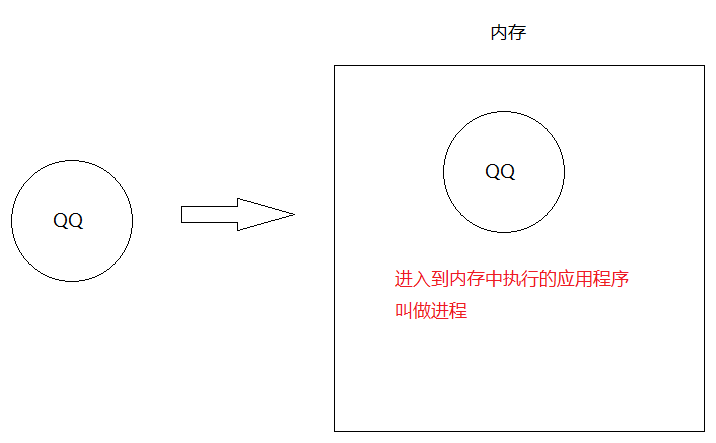

```java
线程:是进程中最小的执行单元
线程作用:负责当前进程中程序的运行.一个进程中至少有一个线程,一个进程还可以有多个线程,这样的应用程序就称之为多线程程序
    
简单理解:一个功能就需要一条线程取去执行    
```

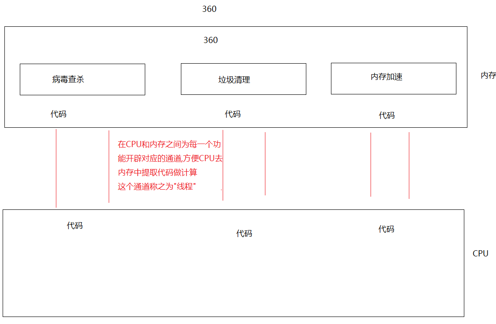

> 1.使用场景: 软件中的耗时操作 -> 拷贝大文件, 加载大量的资源
>
> ​                     所有的聊天软件
>
> ​                     所有的后台服务器
>
> ​    一个线程可以干一件事,我们就可以同时做多件事了,提高了CPU的利用率

## 并发和并行

```java
并行:在同一个时刻,有多个执行在多个CPU上(同时)执行(好比是多个人做不同的事儿)
    比如:多个厨师在炒多个菜
```

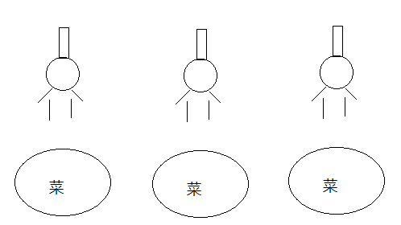

```java
并发:在同一个时刻,有多个指令在单个CPU上(交替)执行
    比如:一个厨师在炒多个菜
```

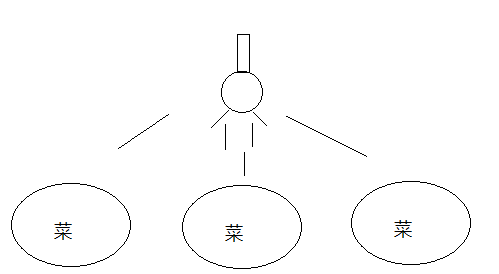

```java
细节:
  1.之前CPU是单核,但是在执行多个程序的时候好像是在同时执行,原因是CPU在多个线程之间做高速切换
  2.现在咱们的CPU都是多核多线程的了,比如2核4线程,那么CPU可以同时运行4个线程,此时不同切换,但是如果多了,CPU就要切换了,所以现在CPU在执行程序的时候并发和并行都存在    
```

## CPU调度

```java
1.分时调度:指的是让所有的线程轮流获取CPU使用权,并且平均分配每个线程占用CPU的时间片
2.抢占式调度:多个线程轮流抢占CPU使用权,哪个线程先抢到了,哪个线程先执行,一般都是优先级高的先抢到CPU使用权的几率大,我们java程序就是抢占式调度    
```

## 主线程介绍

```java
主线程:CPU和内存之间开辟的转门为main方法服务的线程
```

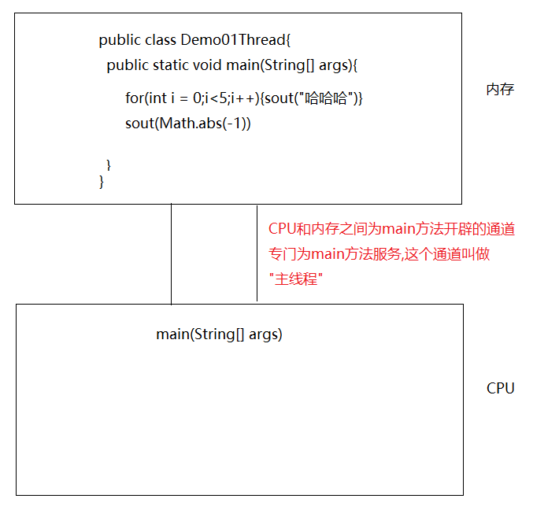

# 创建线程的方式(重点)

## 第一种方式：extends Thread

```java
1.定义一个类,继承Thread
2.重写run方法,在run方法中设置线程任务(所谓的线程任务指的是此线程要干的具体的事儿,具体执行的代码)
3.创建自定义线程类的对象 
4.调用Thread中的start方法,开启线程,jvm自动调用run方法
```

**声明自定义线程类并重写`run()`方法：**

```java
public class MyThread extends Thread{
    @Override
    public void run() {
        for (int i = 0; i < 10; i++) {
            System.out.println("MyThread...执行了"+i);
        }
    }
}
```

**创建自定义线程类并执行`start()`方法：**

```java
public class Test01 {
    public static void main(String[] args) {
        // 1、 创建线程对象
        MyThread myThread = new MyThread();
        // 2、调用start方法,开启线程,jvm自动调用run方法
        myThread.start();

        // 直接调用run方法并不是开启线程,只是方法简单调用,会先执行线程方法,再执行Main方法
//        myThread.run();

        for (int i = 0; i < 5; i++) {
            System.out.println("Main方法执行了:"+i);
        }
    }
}

```

## 多线程在内存中的运行原理

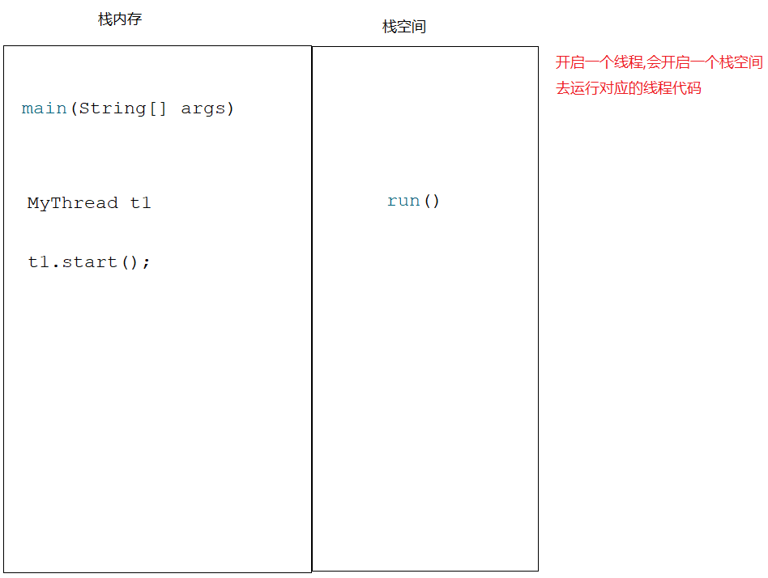

<font color = 'red'>**注意:同一个线程对象不能连续调用多次start,如果想要再次调用start,那么咱们就new一个新的线程对象**</font>

## Thread类中的方法

```java
void start() -> 开启线程,jvm自动调用run方法
void run()  -> 设置线程任务,这个run方法是Thread重写的接口Runnable中的run方法
String getName()  -> 获取线程名字
void setName(String name) -> 给线程设置名字
static Thread currentThread() -> 获取正在执行的线程对象(此方法在哪个线程中使用,获取的就是哪个线程对象)   
static void sleep(long millis)->线程睡眠,超时后自动醒来继续执行,传递的是毫秒值    
```

```java
public class MyThread extends Thread{
    @Override
    public void run() {
        for (int i = 0; i < 10; i++) {
            //线程睡眠
            try {
                Thread.sleep(1000L);
            } catch (InterruptedException e) {
                throw new RuntimeException(e);
            }
            System.out.println(Thread.currentThread().getName()+"...执行了"+i);
        }
    }
}

```

```java
public class Test01 {
    public static void main(String[] args) throws InterruptedException {
        //创建线程对象
        MyThread t1 = new MyThread();

        //给线程设置名字
        t1.setName("金莲");

        //调用start方法,开启线程,jvm自动调用run方法
        t1.start();

        for (int i = 0; i < 10; i++) {
            Thread.sleep(1000L);
            System.out.println(Thread.currentThread().getName()+"线程..........执行了"+i);
        }
    }
}

```

> 问题：为啥在重写的run方法中有异常只能try catch,不能throws？
>
> 原因：继承的Thread中的run方法没有抛异常,所以在子类中重写完run方法之后就不能抛,只能try catch

## Thread中其他的方法

```java
void setPriority(int newPriority)   -> 设置线程优先级,优先级越高的线程,抢到CPU使用权的几率越大,但是不是每次都先抢到
    
int getPriority()  -> 获取线程优先级
    
void setDaemon(boolean on)  -> 设置为守护线程,当非守护线程执行完毕,守护线程就要结束,但是守护线程也不是立马结束,当非守护线程结束之后,系统会告诉守护线程人家结束了,你也结束吧,在告知的过程中,守护线程会执行,只不过执行到半路就结束了
    
static void yield() -> 礼让线程,让当前线程让出CPU使用权
   
void join() -> 插入线程或者叫做插队线程    
```

### 线程优先级

```java
public class MyThread1 extends Thread{
    @Override
    public void run() {
        for (int i = 0; i < 10; i++) {
            System.out.println(Thread.currentThread().getName()+"执行了......"+i);
        }
    }
}
```

```java
public class Test01 {
    public static void main(String[] args) {
        MyThread1 t1 = new MyThread1();
        t1.setName("金莲");

        MyThread1 t2 = new MyThread1();
        t2.setName("阿庆");

        /*
           获取两个线程的优先级
           MIN_PRIORITY = 1 最小优先级 1
           NORM_PRIORITY = 5 默认优先级 5
           MAX_PRIORITY = 10 最大优先级 10
         */
        //System.out.println(t1.getPriority());
        //System.out.println(t2.getPriority());

        //设置优先级
        t1.setPriority(1);
        t2.setPriority(10);

        t1.start();
        t2.start();
    }
}

```

### 守护线程

```java
public class Test01 {
    public static void main(String[] args) {
        MyThread1 t1 = new MyThread1();
        t1.setName("金莲");

        MyThread2 t2 = new MyThread2();
        t2.setName("阿庆");

        //将t2设置成守护线程
        t2.setDaemon(true);

        t1.start();
        t2.start();
    }
}

```

```java
public class MyThread1 extends Thread{
    @Override
    public void run() {
        for (int i = 0; i < 10; i++) {
            System.out.println(Thread.currentThread().getName()+"执行了......"+i);
        }
    }
}
```

```java
public class MyThread2 extends Thread{
    @Override
    public void run() {
        for (int i = 0; i < 100; i++) {
            System.out.println(Thread.currentThread().getName()+"执行了..."+i);
        }
    }
}

```

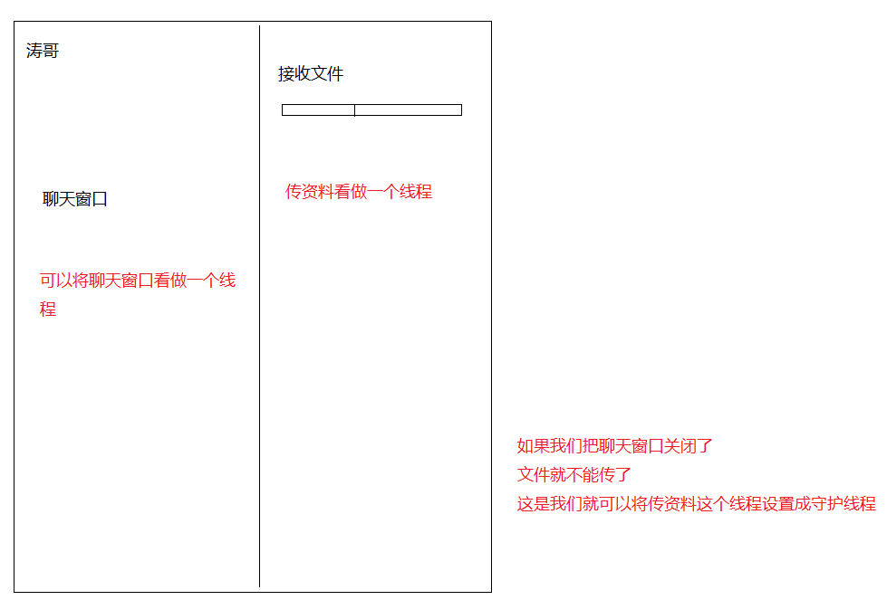

### 礼让线程

```java
场景说明:如果两个线程一起执行,可能会执行一会儿线程A,再执行一会线程B,或者可能线程A执行完毕了,线程B在执行
        那么我们能不能让两个线程尽可能的平衡一点 -> 尽量让两个线程交替执行
注意:只是尽可能的平衡,不是绝对的你来我往,有可能线程A线程执行,然后礼让了,但是回头A又抢到CPU使用权了    
```

```java
public class Test01 {
    public static void main(String[] args) {
        MyThread1 t1 = new MyThread1();
        t1.setName("金莲");

        MyThread1 t2 = new MyThread1();
        t2.setName("阿庆");


        t1.start();
        t2.start();
    }
}
```

```java
public class MyThread1 extends Thread{
    @Override
    public void run() {
        for (int i = 0; i < 10; i++) {
            System.out.println(Thread.currentThread().getName()+"执行了......"+i);
            Thread.yield();
        }
    }
}

```

### 插入线程

```java
public class MyThread1 extends Thread{
    @Override
    public void run() {
        for (int i = 0; i < 10; i++) {
            System.out.println(Thread.currentThread().getName()+"执行了......"+i);
        }
    }
}
```

```java
public class Test01 {
    public static void main(String[] args) throws InterruptedException {
        MyThread1 t1 = new MyThread1();
        t1.setName("金莲");
        t1.start();

        /*
          表示把t1插入到当前线程之前,t1要插到main线程之前,所以当前线程就是main线程
         */
        t1.join();

        for (int i = 0; i < 10; i++) {
            System.out.println(Thread.currentThread().getName()+"执行了......"+i);
        }
    }
}
```

## 第二种方式: 实现Runnable接口

```java
1.创建类,实现Runnable接口
2.重写run方法,设置线程任务
3.利用Thread类的构造方法:Thread(Runnable target),创建Thread对象(线程对象),将自定义的类当参数传递到Thread构造中 -> 这一步是让我们自己定义的类成为一个真正的线程类对象
4.调用Thread中的start方法,开启线程,jvm自动调用run方法    
```

```java
public class Test01 {
    public static void main(String[] args) {
        MyRunnable myRunnable = new MyRunnable();

        /*
           Thread(Runnable target)
         */
        Thread t1 = new Thread(myRunnable);
        //调用Thread中的start方法,开启线程
        t1.start();

        for (int i = 0; i < 10; i++) {
            System.out.println(Thread.currentThread().getName()+"...执行了"+i);
        }
    }
}
```

```java
public class MyRunnable implements Runnable{
    @Override
    public void run() {
        for (int i = 0; i < 10; i++) {
            System.out.println(Thread.currentThread().getName()+"...执行了"+i);
        }
    }
}
```

## 两种实现多线程的方式区别

```java
1.继承Thread:继承只支持单继承,有继承的局限性
2.实现Runnable:没有继承的局限性, MyThread extends Fu implements Runnable
```

## 第三种方式: 匿名内部类创建多线程

> 严格意义上来说，匿名内部类方式不属于创建多线程方式其中之一,因为匿名内部类形式建立在实现Runnable接口的基础上完成的

```java
匿名内部类回顾: 
  1.new 接口/抽象类(){
      重写方法
  }.重写的方法();

  2.接口名/类名 对象名 = new 接口/抽象类(){
      重写方法
  }
    对象名.重写的方法();
```

```java
public class Test02 {
    public static void main(String[] args) {
        /*
          Thread(Runnable r)
          Thread(Runnable target, String name) :name指的是给线程设置名字
         */

        new Thread(new Runnable() {
            @Override
            public void run() {
                for (int i = 0; i < 10; i++) {
                    System.out.println(Thread.currentThread().getName()+"...执行了"+i);
                }
            }
        },"阿庆").start();

        new Thread(new Runnable() {
            @Override
            public void run() {
                for (int i = 0; i < 10; i++) {
                    System.out.println(Thread.currentThread().getName()+"...执行了"+i);
                }
            }
        },"金莲").start();
    }
}

```

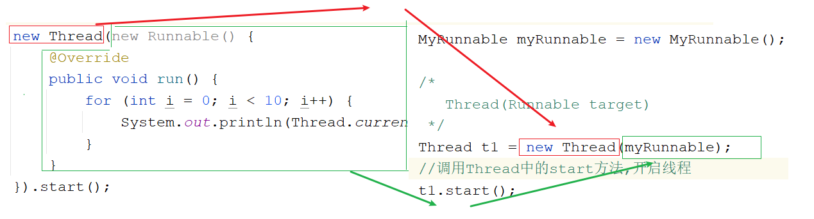

# 线程安全

```java
1.什么时候发生:当多个线程访问同一个资源时,导致了数据有问题
```

## 线程安全问题（线程不安全的代码）

```java
public class MyTicket implements Runnable{
    //定义100张票
    int ticket = 100;

    @Override
    public void run() {
        while(true){
            if (ticket>0){
                System.out.println(Thread.currentThread().getName()+"买了第"+ticket+"张票");
                ticket--;
            }
        }
    }
}

```

```java
public class Test01 {
    public static void main(String[] args) {
        MyTicket myTicket = new MyTicket();

        Thread t1 = new Thread(myTicket, "赵四");
        Thread t2 = new Thread(myTicket, "刘能");
        Thread t3 = new Thread(myTicket, "广坤");

        t1.start();
        t2.start();
        t3.start();
    }
}
```

<font color = 'red'>**产生原因:CPU在多个线程之间做高速切换导致的**</font>

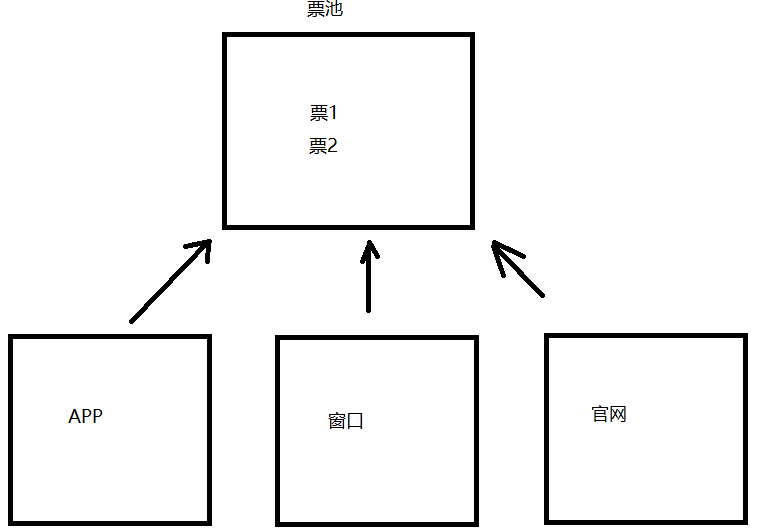

## 解决线程安全问题的第一种方式(使用同步代码块)

```java
1.格式:
  synchronized(任意对象){
      线程可能出现不安全的代码
  }
2.任意对象:就是我们的锁对象
3.执行:
  一个线程拿到锁之后,会进入到同步代码块中执行,在此期间,其他线程拿不到锁,就进不去同步代码块,需要在同步代码块外面等待排队,需要等着执行的线程执行完毕,出了同步代码块,相当于释放锁了,等待的线程才能抢到锁,才能进入到同步代码块中执行
4. 注意：必须是同一个锁对象
```

```java
public class MyTicket implements Runnable{
    //定义100张票
    int ticket = 100;

    //任意new一个对象
    Object obj = new Object();

    @Override
    public void run() {
        while(true){
            try {
                Thread.sleep(100L);
            } catch (InterruptedException e) {
                throw new RuntimeException(e);
            }
            synchronized (obj){
                if (ticket>0){
                    System.out.println(Thread.currentThread().getName()+"买了第"+ticket+"张票");
                    ticket--;
                }
            }

        }
    }
}
```

```java
public class Test01 {
    public static void main(String[] args) {
        MyTicket myTicket = new MyTicket();

        Thread t1 = new Thread(myTicket, "赵四");
        Thread t2 = new Thread(myTicket, "刘能");
        Thread t3 = new Thread(myTicket, "广坤");

        t1.start();
        t2.start();
        t3.start();
    }
}
```

## 解决线程安全问题的第二种方式:同步方法

### 普通同步方法（非静态）

``` java
1.格式:
  修饰符 synchronized 返回值类型 方法名(参数){
      方法体
      return 结果
  }
2.默认锁:this
```

```java
public class MyTicket implements Runnable{
    //定义100张票
    int ticket = 100;

    @Override
    public void run() {
        while(true){
            try {
                Thread.sleep(100L);
            } catch (InterruptedException e) {
                throw new RuntimeException(e);
            }
           //method01();
            method02();
        }
    }

   /* public synchronized void method01(){
        if (ticket>0){
            System.out.println(Thread.currentThread().getName()+"买了第"+ticket+"张票");
            ticket--;
        }
    }*/
   public void method02(){
       synchronized(this){
           System.out.println(this+"..........");
           if (ticket>0){
               System.out.println(Thread.currentThread().getName()+"买了第"+ticket+"张票");
               ticket--;
           }
       }

   }

}

```

```java
public class Test01 {
    public static void main(String[] args) {
        MyTicket myTicket = new MyTicket();
        System.out.println(myTicket);

        Thread t1 = new Thread(myTicket, "赵四");
        Thread t2 = new Thread(myTicket, "刘能");
        Thread t3 = new Thread(myTicket, "广坤");

        t1.start();
        t2.start();
        t3.start();
    }
}

```

### 静态同步方法

```java
1.格式:
  修饰符 static synchronized 返回值类型 方法名(参数){
      方法体
      return 结果
  }
2.默认锁:class对象
```

```java
public class MyTicket implements Runnable{
    //定义100张票
    static int ticket = 100;

    @Override
    public void run() {
        while(true){
            try {
                Thread.sleep(100L);
            } catch (InterruptedException e) {
                throw new RuntimeException(e);
            }
           //method01();
            method02();
        }
    }

    /*public static synchronized void method01(){
        if (ticket>0){
            System.out.println(Thread.currentThread().getName()+"买了第"+ticket+"张票");
            ticket--;
        }
    }*/
   public static void method02(){
       synchronized(MyTicket.class){
           if (ticket>0){
               System.out.println(Thread.currentThread().getName()+"买了第"+ticket+"张票");
               ticket--;
           }
       }

   }
}
```

```java
public class Test01 {
    public static void main(String[] args) {
        MyTicket myTicket = new MyTicket();

        Thread t1 = new Thread(myTicket, "赵四");
        Thread t2 = new Thread(myTicket, "刘能");
        Thread t3 = new Thread(myTicket, "广坤");

        t1.start();
        t2.start();
        t3.start();
    }
}

```

# 死锁(了解)

## 死锁介绍(锁嵌套就有可能产生死锁)

```java
指的是两个或者两个以上的线程在执行的过程中由于竞争同步锁而产生的一种阻塞现象;如果没有外力的作用,他们将无法继续执行下去,这种情况称之为死锁
```

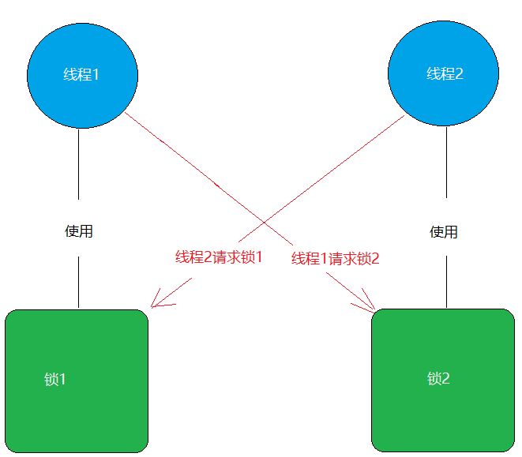

```java
根据上图所示:线程1正在持有锁1,但是线程1必须再拿到锁2,才能继续执行
而线程2正在持有锁2,但是线程2需要再拿到锁1,才能继续执行
此时两个线程处于互相等待的状态,就是死锁,在程序中的死锁将出现在同步代码块的嵌套中
```

## 死锁的分析

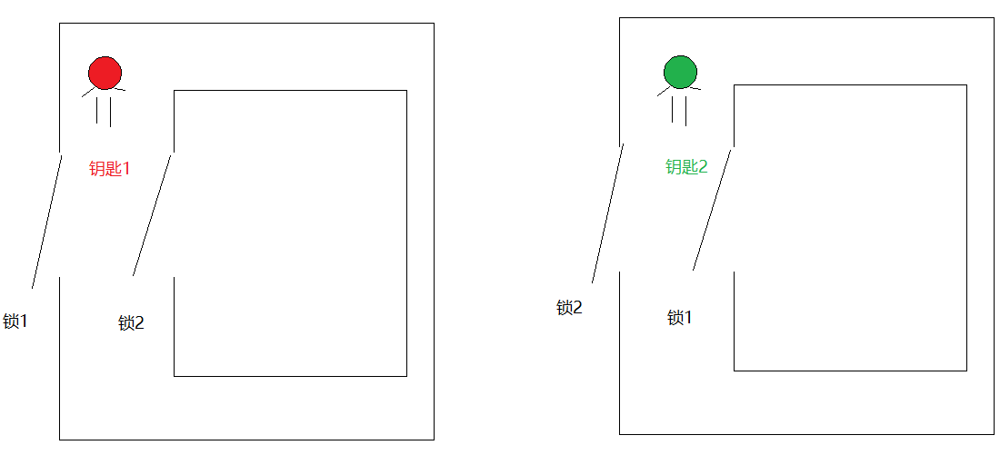

## 代码实现

```java
public class LockA {
    public static LockA lockA = new LockA();
}

```

```java
public class LockB {
    public static LockB lockB = new LockB();
}
```

```java
public class DieLock implements Runnable{
    private boolean flag;

    public DieLock(boolean flag) {
        this.flag = flag;
    }

    @Override
    public void run() {
        if (flag){
            synchronized (LockA.lockA){
                System.out.println("if...lockA");
                synchronized (LockB.lockB){
                    System.out.println("if...lockB");
                }
            }
        }else{
            synchronized (LockB.lockB){
                System.out.println("else...lockB");
                synchronized (LockA.lockA){
                    System.out.println("else...lockA");
                }
            }
        }
    }
}

```

```java
public class Test01 {
    public static void main(String[] args) {
        DieLock dieLock1 = new DieLock(true);
        DieLock dieLock2 = new DieLock(false);

        new Thread(dieLock1).start();
        new Thread(dieLock2).start();
    }
}
```

> 只需要知道死锁出现的原因即可(锁嵌套),以后尽量避免锁嵌套
>

# 线程状态

## 线程状态介绍

```java
  当线程被创建并启动以后，它既不是一启动就进入了执行状态，也不是一直处于执行状态。在线程的生命周期中，有几种状态呢？在API中java.lang.Thread.State这个枚举中给出了六种线程状态：
  这里先列出各个线程状态发生的条件，下面将会对每种状态进行详细解析。
```

| 线程状态                | 导致状态发生条件                                             |
| ----------------------- | ------------------------------------------------------------ |
| NEW(新建)               | 线程刚被创建，但是并未启动。还没调用start方法。              |
| Runnable(可运行)        | 线程可以在java虚拟机中运行的状态，可能正在运行自己代码，也可能没有，这取决于操作系统处理器。 |
| Blocked(锁阻塞)         | 当一个线程试图获取一个对象锁，而该对象锁被其他的线程持有，则该线程进入Blocked状态；当该线程持有锁时，该线程将变成Runnable状态。 |
| Waiting(无限等待)       | 一个线程在等待另一个线程执行一个（唤醒）动作时，该线程进入Waiting状态。进入这个状态后是不能自动唤醒的，必须等待另一个线程调用notify或者notifyAll方法才能够唤醒。 |
| Timed Waiting(计时等待) | 同waiting状态，有几个方法有超时参数，调用他们将进入Timed Waiting状态。这一状态将一直保持到超时期满或者接收到唤醒通知。带有超时参数的常用方法有Thread.sleep 、Object.wait。 |
| Terminated(被终止)      | 因为run方法正常退出而死亡，或者因为没有捕获的异常终止了run方法而死亡。或者调用过时方法stop() |

## 线程状态图

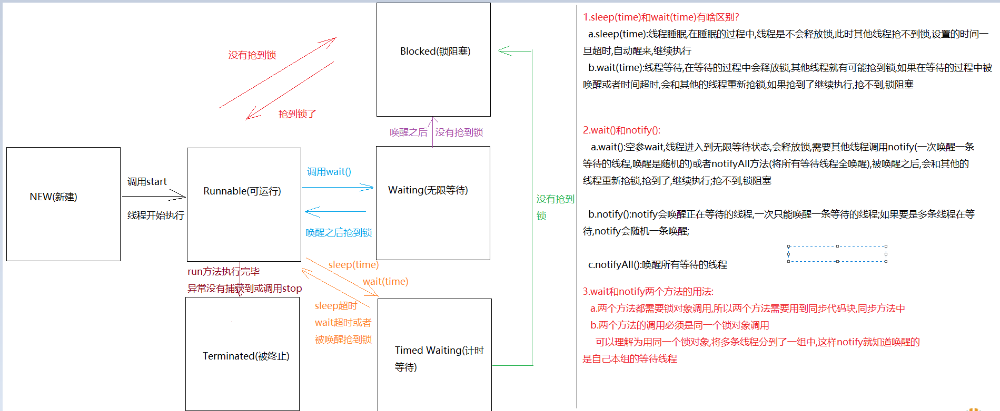

# 模块十六总结及模块十七重点

```
模块16回顾:
  1.创建多线程:
    继承Thread
          a.定义一个类,继承Thread
          b.重写run方法,设置线程任务
          c.创建自定义线程对象
          d.调用start方法,开启线程,jvm自动执行run方法
    实现Runnable接口:
          a.定义一个类,实现Runnable
          b.重写run方法,设置线程任务
          c.创建自定义线程对象,传递到Thread对象中
          d.调用start方法,开启线程,jvm自动调用run方法
    匿名内部类形式创建:
          new Thread(new Runnable(){
              重写run
          }).start();

  2.Thread中的方法:
    a.start():开启线程,jvm自动调用run方法
    b.getName():获取线程名字
    c.setName(String name):设置线程名字
    d.currentThread():获取当前正在执行的线程对象
    e.sleep(long time):线程睡眠
    f.setPriority(int n) :设置线程优先级
    g.getPriority():获取线程优先级
    h.setDaemon(true):设置为守护线程
    i.yield():礼让线程
    j:join():插队线程
        
  3.线程安全:
    a.同步代码块:
      synchronized(锁对象){
          
      }

    b.同步方法: -> 在定义方法的时候加上synchronized关键字
      非静态:默认锁this
      静态的:默认锁class对象
          
模块17重点:
  1.会用wait和notify两个方法
  2.会使用Lock锁对象
  3.会利用Callable接口实现多线程
  4.会使用线程池完成多线程
```

# 等待唤醒机制

## 等待唤醒案例分析(线程之间的通信)

```java
要求:一个线程生产,一个线程消费,不能连续生产,不能连续消费 -> 等待唤醒机制(生产者,消费者)(线程之间的通信)
```

| 方法             | 说明                                                         |
| ---------------- | ------------------------------------------------------------ |
| void wait()      | 线程等待,等待的过程中线程会释放锁,需要被其他线程调用notify方法将其唤醒,重新抢锁执行 |
| void notify()    | 线程唤醒,一次唤醒一个等待线程;如果有多条线程等待,则随机唤醒一条等待线程 |
| void notifyAll() | 唤醒所有等待线程                                             |

> wait和notify方法需要锁对象调用,所以需要用到同步代码块中,而且必须是同一个锁对象

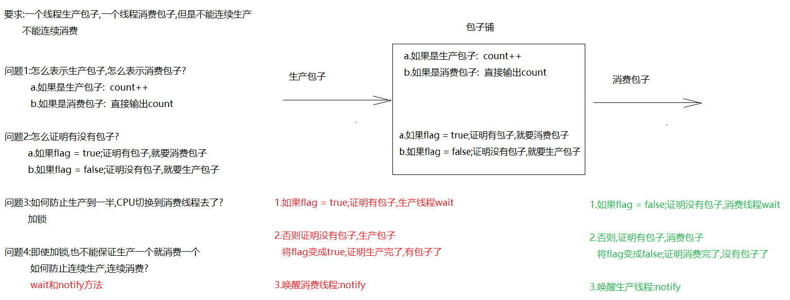

## 等待唤醒案例实现

```java
/*
   count和flag可以定义成包装类
   但是要记得给count和flag手动赋值
   不然对于本案例来说,容易出现空指针异常
 */
public class BaoZiPu {
    //代表包子的count
    private int count;
    //代表是否有包子的flag
    private boolean flag;

    public BaoZiPu() {
    }

    public BaoZiPu(int count, boolean flag) {
        this.count = count;
        this.flag = flag;
    }

    /*
       getCount 改造成消费包子方法
       直接输出count
     */
    public void getCount() {
        System.out.println("消费了..............第"+count+"个包子");
    }

    /*
       setCount 改造成生产包子
       count++
     */
    public void setCount() {
        count++;
        System.out.println("生产了...第"+count+"个包子");
    }

    public boolean isFlag() {
        return flag;
    }

    public void setFlag(boolean flag) {
        this.flag = flag;
    }
}

```

```java
public class Product implements Runnable{
    private BaoZiPu baoZiPu;

    public Product(BaoZiPu baoZiPu) {
        this.baoZiPu = baoZiPu;
    }

    @Override
    public void run() {
        while(true){

            try {
                Thread.sleep(100L);
            } catch (InterruptedException e) {
                throw new RuntimeException(e);
            }

            synchronized (baoZiPu){
                //1.判断flag是否为true,如果是true,证明有包子,生产线程等待
                if (baoZiPu.isFlag()==true){
                    try {
                        baoZiPu.wait();
                    } catch (InterruptedException e) {
                        throw new RuntimeException(e);
                    }
                }

                //2.如果flag为false,证明没有包子,开始生产
                baoZiPu.setCount();
                //3.改变flag状态,为true,证明生产完了,有包子了
                baoZiPu.setFlag(true);
                //4.唤醒消费线程
                baoZiPu.notify();
            }
        }
    }
}

```

```java
public class Consumer implements Runnable{
    private BaoZiPu baoZiPu;

    public Consumer(BaoZiPu baoZiPu) {
        this.baoZiPu = baoZiPu;
    }

    @Override
    public void run() {
        while(true){

            try {
                Thread.sleep(100L);
            } catch (InterruptedException e) {
                throw new RuntimeException(e);
            }

            synchronized (baoZiPu){
                //1.判断flag是否为false,如果是false,证明没有包子,消费线程等待
                if (baoZiPu.isFlag()==false){
                    try {
                        baoZiPu.wait();
                    } catch (InterruptedException e) {
                        throw new RuntimeException(e);
                    }
                }

                //2.如果flag为true,证明有包子,开始消费
                baoZiPu.getCount();
                //3.改变flag状态,为false,证明消费完了,没 有包子了
                baoZiPu.setFlag(false);
                //4.唤醒生产线程
                baoZiPu.notify();
            }
        }
    }
}

```

```java
public class Test01 {
    public static void main(String[] args) {
        BaoZiPu baoZiPu = new BaoZiPu();

        Product product = new Product(baoZiPu);
        Consumer consumer = new Consumer(baoZiPu);

        Thread t1 = new Thread(product);
        Thread t2 = new Thread(consumer);

        t1.start();
        t2.start();
    }
}
```

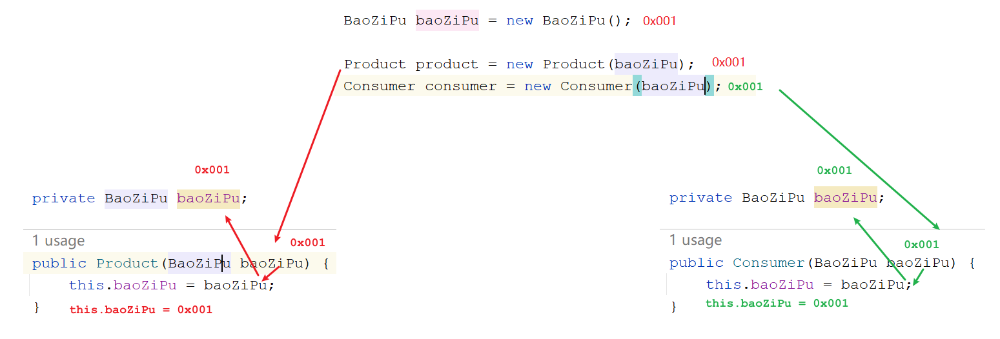


## 用同步方法改造等待唤醒案例

```java
/*
   count和flag可以定义成包装类
   但是要记得给count和flag手动赋值
   不然对于本案例来说,容易出现空指针异常
 */
public class BaoZiPu {
    //代表包子的count
    private int count;
    //代表是否有包子的flag
    private boolean flag;

    public BaoZiPu() {
    }

    public BaoZiPu(int count, boolean flag) {
        this.count = count;
        this.flag = flag;
    }

    /*
       getCount 改造成消费包子方法
       直接输出count
     */
    public synchronized void getCount() {
        //1.判断flag是否为false,如果是false,证明没有包子,消费线程等待
        if (this.flag == false) {
            try {
                this.wait();
            } catch (InterruptedException e) {
                throw new RuntimeException(e);
            }
        }

        //2.如果flag为true,证明有包子,开始消费
        System.out.println("消费了..............第" + count + "个包子");

        //3.改变flag状态,为false,证明消费完了,没 有包子了
        this.flag = false;
        //4.唤醒生产线程
        this.notify();
    }

    /*
       setCount 改造成生产包子
       count++
     */
    public synchronized void setCount() {
        //1.判断flag是否为true,如果是true,证明有包子,生产线程等待
        if (this.flag == true) {
            try {
                this.wait();
            } catch (InterruptedException e) {
                throw new RuntimeException(e);
            }
        }

        //2.如果flag为false,证明没有包子,开始生产
        count++;
        System.out.println("生产了...第" + count + "个包子");
        //3.改变flag状态,为true,证明生产完了,有包子了
        this.flag = true;
        //4.唤醒消费线程
        this.notify();
    }

    public boolean isFlag() {
        return flag;
    }

    public void setFlag(boolean flag) {
        this.flag = flag;
    }
}

```

```java
public class Product implements Runnable{
    private BaoZiPu baoZiPu;

    public Product(BaoZiPu baoZiPu) {
        this.baoZiPu = baoZiPu;
    }

    @Override
    public void run() {
        while(true){

            try {
                Thread.sleep(100L);
            } catch (InterruptedException e) {
                throw new RuntimeException(e);
            }
            baoZiPu.setCount();
        }
    }
}

```

```java
public class Consumer implements Runnable{
    private BaoZiPu baoZiPu;

    public Consumer(BaoZiPu baoZiPu) {
        this.baoZiPu = baoZiPu;
    }

    @Override
    public void run() {
        while(true){

            try {
                Thread.sleep(100L);
            } catch (InterruptedException e) {
                throw new RuntimeException(e);
            }

            baoZiPu.getCount();
        }
    }
}

```

```java
public class Test01 {
    public static void main(String[] args) {
        BaoZiPu baoZiPu = new BaoZiPu();

        Product product = new Product(baoZiPu);
        Consumer consumer = new Consumer(baoZiPu);

        Thread t1 = new Thread(product);
        Thread t2 = new Thread(consumer);

        t1.start();
        t2.start();
    }
}
```

<font color = 'red'>存在问题：当线程被唤醒后会跳出if判断，继续执行后面的操作，此案例中可以这么使用，但是如果有更多线程同时执行生产和消费动作则会出现问题</font>

# 多等待多唤醒

## 解决多生产多消费问题(if改为while,将notify改为notifyAll)

```java
public class Test01 {
    public static void main(String[] args) {
        BaoZiPu baoZiPu = new BaoZiPu();

        Product product = new Product(baoZiPu);
        Consumer consumer = new Consumer(baoZiPu);

        new Thread(product).start();
        new Thread(product).start();
        new Thread(product).start();

        new Thread(consumer).start();
        new Thread(consumer).start();
        new Thread(consumer).start();
    }
}

```

```java
/*
   count和flag可以定义成包装类
   但是要记得给count和flag手动赋值
   不然对于本案例来说,容易出现空指针异常
 */
public class BaoZiPu {
    //代表包子的count
    private int count;
    //代表是否有包子的flag
    private boolean flag;

    public BaoZiPu() {
    }

    public BaoZiPu(int count, boolean flag) {
        this.count = count;
        this.flag = flag;
    }

    /*
       getCount 改造成消费包子方法
       直接输出count
     */
    public synchronized void getCount() {
        //1.判断flag是否为false,如果是false,证明没有包子,消费线程等待
        while (this.flag == false) {
            try {
                this.wait();
            } catch (InterruptedException e) {
                throw new RuntimeException(e);
            }
        }

        //2.如果flag为true,证明有包子,开始消费
        System.out.println("消费了..............第" + count + "个包子");

        //3.改变flag状态,为false,证明消费完了,没 有包子了
        this.flag = false;
        //4.唤醒所有等待线程
        this.notifyAll();
    }

    /*
       setCount 改造成生产包子
       count++
     */
    public synchronized void setCount() {
        //1.判断flag是否为true,如果是true,证明有包子,生产线程等待
        while (this.flag == true) {
            try {
                this.wait();
            } catch (InterruptedException e) {
                throw new RuntimeException(e);
            }
        }

        //2.如果flag为false,证明没有包子,开始生产
        count++;
        System.out.println("生产了...第" + count + "个包子");
        //3.改变flag状态,为true,证明生产完了,有包子了
        this.flag = true;
        //4.唤醒所有等待线程
        this.notifyAll();
    }

    public boolean isFlag() {
        return flag;
    }

    public void setFlag(boolean flag) {
        this.flag = flag;
    }
}

```

```java
public class Product implements Runnable{
    private BaoZiPu baoZiPu;

    public Product(BaoZiPu baoZiPu) {
        this.baoZiPu = baoZiPu;
    }

    @Override
    public void run() {
        while(true){

            try {
                Thread.sleep(100L);
            } catch (InterruptedException e) {
                throw new RuntimeException(e);
            }
            baoZiPu.setCount();
        }
    }
}

```

```java
public class Consumer implements Runnable{
    private BaoZiPu baoZiPu;

    public Consumer(BaoZiPu baoZiPu) {
        this.baoZiPu = baoZiPu;
    }

    @Override
    public void run() {
        while(true){

            try {
                Thread.sleep(100L);
            } catch (InterruptedException e) {
                throw new RuntimeException(e);
            }

            baoZiPu.getCount();
        }
    }
}

```

# Lock锁

## Lock对象的介绍和基本使用

```java
1.概述:Lock是一个接口
2.实现类:ReentrantLock 
3.方法:
  lock() 获取锁
  unlock() 释放锁
```

```java
public class MyTicket implements Runnable {
    //定义100张票
    int ticket = 100;

    //创建Lock对象
    Lock lock = new ReentrantLock();

    @Override
    public void run() {
        while (true) {
            try {
                Thread.sleep(100L);

                //获取锁
                lock.lock();
                if (ticket > 0) {
                    System.out.println(Thread.currentThread().getName() + "买了第" + ticket + "张票");
                    ticket--;
                }
            } catch (InterruptedException e) {
                throw new RuntimeException(e);
            }finally {
                //释放锁
                lock.unlock();
            }

        }
    }
}

```

```java
public class Test01 {
    public static void main(String[] args) {
        MyTicket myTicket = new MyTicket();

        Thread t1 = new Thread(myTicket, "赵四");
        Thread t2 = new Thread(myTicket, "刘能");
        Thread t3 = new Thread(myTicket, "广坤");

        t1.start();
        t2.start();
        t3.start();
    }
}

```

> synchronized：不管是同步代码块还是同步方法,都需要在结束一对{}之后,释放锁对象
> Lock：是通过两个方法控制需要被同步的代码,更灵活

# 实现多线程方式三: Callable接口

```java
1.概述:Callable<V>是一个接口,类似于Runnable
2.方法:
  V call()  -> 设置线程任务的,类似于run方法
3.call方法和run方法的区别:
  a.相同点:都是设置线程任务的
  b.不同点:
    call方法有返回值,而且有异常可以throws
    run方法没有返回值,而且有异常不可以throws
        
4.<V> 
  a.<V>叫做泛型
  b.泛型:用于指定我们操作什么类型的数据,<>中只能写引用数据类型,如果泛型不写,默认是Object类型数据
  c.实现Callable接口时,指定泛型是什么类型的,重写的call方法返回值就是什么类型的
      
5.获取call方法返回值: FutureTask<V>
  a. FutureTask<V> 实现了一个接口: Future <V>
  b. FutureTask<V>中有一个方法:
     V get() -> 获取call方法的返回值
```

```java
public class MyCallable implements Callable<String> {

    @Override
    public String call() throws Exception {
        return "涛哥和金莲...的故事";
    }
}
```

```java
public class Test {
    public static void main(String[] args) throws ExecutionException, InterruptedException {
        MyCallable myCallable = new MyCallable();
        /*
           FutureTask(Callable<V> callable)
         */
        FutureTask<String> futureTask = new FutureTask<>(myCallable);

        //创建Thread对象-> Thread(Runnable target)
        Thread t1 = new Thread(futureTask);
        t1.start();

        //调用get方法获取call方法返回值
        System.out.println(futureTask.get());
    }
}
```

# 实现多线程方式四: 线程池

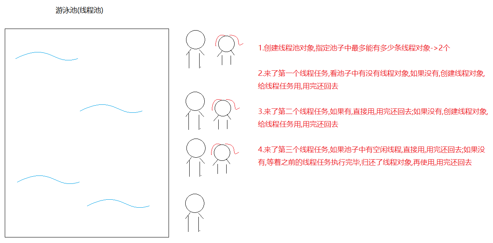

```java
1.问题:之前来一个线程任务,就需要创建一个线程对象去执行,用完还要销毁线程对象,如果线程任务多了,就需要频繁创建线程对象和销毁线程对象,这样会耗费内存资源,所以我们就想线程对象能不能循环利用,用的时候直接拿线程对象,用完还回去
```

```java
1.如何创建线程池对象:用具类-> Executors
2.获取线程池对象:Executors中的静态方法:
  static ExecutorService newFixedThreadPool(int nThreads)  
  a.参数:指定线程池中最多创建的线程对象条数
  b.返回值ExecutorService 是线程池,用来管理线程对象
      
3.执行线程任务: ExecutorService中的方法
  Future<?> submit(Runnable task) 提交一个Runnable任务用于执行 
  Future<T> submit(Callable<T> task) 提交一个Callable任务用于执行 
    
4.submit方法的返回值:Future接口
  用于接收run方法或者call方法返回值的,但是run方法没有返回值,所以可以不用Future接收,执行call方法需要用Future接收
    
  Future中有一个方法:V get()  用于获取call方法返回值
    
5. ExecutorService中的方法:
   void shutdown()  启动有序关闭，其中先前提交的任务将被执行，但不会接受任何新任务
```

```java
public class MyRunnable implements Runnable{
    @Override
    public void run() {
        System.out.println(Thread.currentThread().getName()+"...执行了");
    }
}
```

```java
public class Test01 {
    public static void main(String[] args) {
        //创建线程池对象
        ExecutorService es = Executors.newFixedThreadPool(2);
        es.submit(new MyRunnable());
        es.submit(new MyRunnable());
        es.submit(new MyRunnable());

        //es.shutdown();//关闭线程池对象
    }
}
```

```java
public class MyCallable implements Callable<Integer> {
    @Override
    public Integer call() throws Exception {
        return 1;
    }
}
```

```java
public class Test02 {
    public static void main(String[] args) throws ExecutionException, InterruptedException {
        ExecutorService es = Executors.newFixedThreadPool(2);
        Future<Integer> future = es.submit(new MyCallable());
        System.out.println(future.get());
    }
}
```

## 练习

```java
需求:创建两个线程任务,一个线程任务完成1-100的和,一个线程任务返回一个字符串
```

```java
public class MyString implements Callable<String> {
    @Override
    public String call() throws Exception {
        return "那一夜,你没有拒绝我,那一夜,你伤害了我";
    }
}
```

```java
public class MySum implements Callable<Integer> {
    @Override
    public Integer call() throws Exception {
        int sum = 0;
        for (int i = 1; i <= 100; i++) {
            sum+=i;
        }
        return sum;
    }
}
```

```java
public class Test01 {
    public static void main(String[] args) throws ExecutionException, InterruptedException {
        //创建线程池对象
        ExecutorService es = Executors.newFixedThreadPool(2);
        Future<String> f1 = es.submit(new MyString());
        Future<Integer> f2 = es.submit(new MySum());
        System.out.println(f1.get());
        System.out.println(f2.get());
        // 关闭线程池对象
        //es.shutdown();
    }
}
```

# 定时器（Timer）

```java
1.概述:定时器
2.构造:
  Timer()
3.方法:
  void schedule(TimerTask task, Date firstTime, long period)  
                task:抽象类,是Runnable的实现类
                firstTime:从什么时间开始执行
                period: 每隔多长时间执行一次,设置的是毫秒值    
```

```java
public class Demo01Timer {
    public static void main(String[] args) {
        Timer timer = new Timer();
        timer.schedule(new TimerTask() {
            @Override
            public void run() {
                System.out.println("金莲对涛哥说:涛哥,快起床了~~~");
            }
        },new Date(),2000L);
    }
}
```

# 模块十七总结

```
模块17重点回顾:
  1.wait和notify
    a.wait:线程等待,在等待过程中释放锁,需要其他线程调用notify唤醒
    b.notify:唤醒一条等待的线程,如果多条线程等待,随机一条唤醒
    c.notifyAll:唤醒所有等待线程
  2.Lock:锁
    方法:lock()获取锁   unlock()释放锁
  3.线程池:Executors
    a.获取:static ExecutorService newFixedThreadPool(int nThread)
    b.提交线程任务:
      submit(Runnable r) 
      submit(Callable c)
    c.Future:接收run或者call方法的返回值
    d.shutDown()关闭线程池
  4.Callable:类似于Runnable
    a.方法:call()设置线程任务,类似于run方法,但是call可以throws异常,以及有返回值
    b.接收返回值:FutureTask 实现了Future接口
      get()获取call方法的返回值
```

