> 在线视频：[尚硅谷2024最新Java入门视频教程(下部)-集合](https://www.bilibili.com/video/BV1JZ421a7PX?p=109)
> 课程资料：[尚硅谷2024新版Java基础](https://pan.baidu.com/s/1bJiet79tJALKkyNonmOv-w?pwd=yyds )
> 随堂代码：https://gitee.com/an_shiguang/learn-java

> 重点内容：
>
>   1.知道集合的特点以及作用
>   2.会使用Collection接口中的方法
>   3.会使用迭代器迭代集合
>   4.会ArrayList以及LinkedList的使用
>   5.会使用增强for遍历集合
>   
# 集合框架(单列集合)

```java
1.之前我们学了保存数据的有:变量,数组,但是数组定长,所以如果添加一个数据或者删除一个数据,数组并不好使,需要创建新数组,所以接下来我们学一个长度可变的容器,集合
    
2.集合的特点
  a.只能存储引用数据类型的数据
  b.长度可变
  c.集合中有大量的方法,方便我们操作
    
3.分类:
  a.单列集合:一个元素就一个组成部分:
    list.add("张三")
  b.双列集合:一个元素有两部分构成:  key 和 value
    map.put("涛哥","金莲") -> key,value叫做键值对  
    
```

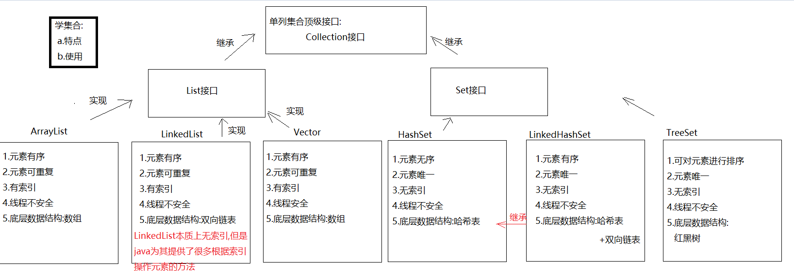

# Collection接口

```java
1.概述:单列集合的顶级接口
2.使用:
  a.创建:
    Collection<E> 对象名 = new 实现类对象<E>()
  b.<E>:泛型,决定了集合中能存储什么类型的数据,可以统一元素类型
        泛型中只能写引用数据类型,如果不写,默认Object类型,此时什么类型的数据都可以存储了
        <int> 不行
        <Integer> 行
        <Person> 行
      
  c.泛型细节:
    我们等号前面的泛型必须写,等号后面的泛型可以不写,jvm会根据前面的泛型推导出后面的泛型是啥
      
3.常用方法:
  boolean add(E e) : 将给定的元素添加到当前集合中(我们一般调add时,不用boolean接收,因为add一定会成功)
  boolean addAll(Collection<? extends E> c) :将另一个集合元素添加到当前集合中 (集合合并)
  void clear():清除集合中所有的元素
  boolean contains(Object o)  :判断当前集合中是否包含指定的元素
  boolean isEmpty() : 判断当前集合中是否有元素->判断集合是否为空
  boolean remove(Object o):将指定的元素从集合中删除
  int size() :返回集合中的元素个数。
  Object[] toArray(): 把集合中的元素,存储到数组中  
```

```java
public class Demo01Collection {
    public static void main(String[] args) {
        Collection<String> collection = new ArrayList<>();
        //boolean add(E e) : 将给定的元素添加到当前集合中(我们一般调add时,不用boolean接收,因为add一定会成功)
        collection.add("萧炎");
        collection.add("萧薰儿");
        collection.add("彩鳞");
        collection.add("小医仙");
        collection.add("云韵");
        collection.add("涛哥");
        System.out.println(collection);
        //boolean addAll(Collection<? extends E> c) :将另一个集合元素添加到当前集合中 (集合合并)
        Collection<String> collection1 = new ArrayList<>();
        collection1.add("张无忌");
        collection1.add("小昭");
        collection1.add("赵敏");
        collection1.add("周芷若");
        collection1.addAll(collection);
        System.out.println(collection1);

        //void clear():清除集合中所有的元素
        collection1.clear();
        System.out.println(collection1);
        //boolean contains(Object o)  :判断当前集合中是否包含指定的元素
        boolean result01 = collection.contains("涛哥");
        System.out.println("result01 = " + result01);
        //boolean isEmpty() : 判断当前集合中是否有元素->判断集合是否为空
        System.out.println(collection1.isEmpty());
        //boolean remove(Object o):将指定的元素从集合中删除
        collection.remove("涛哥");
        System.out.println(collection);
        //int size() :返回集合中的元素个数。
        System.out.println(collection.size());
        //Object[] toArray(): 把集合中的元素,存储到数组中
        Object[] arr = collection.toArray();
        System.out.println(Arrays.toString(arr));
    }
}
```

# 迭代器

## 迭代器基本使用

```java
1.概述:Iterator接口
2.主要作用:遍历集合
3.获取:Collection中的方法:
  Iterator<E> iterator()
4.方法:
  boolean hasNext()  -> 判断集合中有没有下一个元素
  E next()  ->获取下一个元素    
```

```java
public class Demo01Iterator {
    public static void main(String[] args) {
        ArrayList<String> list = new ArrayList<>();
        list.add("楚雨荨");
        list.add("慕容云海");
        list.add("端木磊");
        list.add("上官瑞谦");
        list.add("叶烁");
        //获取迭代器对象
        Iterator<String> iterator = list.iterator();
        while(iterator.hasNext()){
            String element = iterator.next();
            System.out.println(element);
        }
    }
}
```

**<font color = 'red'>注意：next方法在获取的时候不要连续使用多次，否则可能会出现`NoSuchElementException`</font>**

```java
public class Demo02Iterator {
    public static void main(String[] args) {
        ArrayList<String> list = new ArrayList<>();
        list.add("楚雨荨");
        list.add("慕容云海");
        list.add("端木磊");
        list.add("上官瑞谦");
        list.add("叶烁");
        //获取迭代器对象
        Iterator<String> iterator = list.iterator();
        while (iterator.hasNext()) {
            String element = iterator.next();
            System.out.println(element);
            //String element2 = iterator.next();
            //System.out.println(element2);
        }
    }
}
```

## 迭代器迭代过程

```java
int cursor; //下一个元素索引位置
int lastRet = -1;//上一个元素索引位置

public boolean hasNext(){
    return cursor !=size
}
```

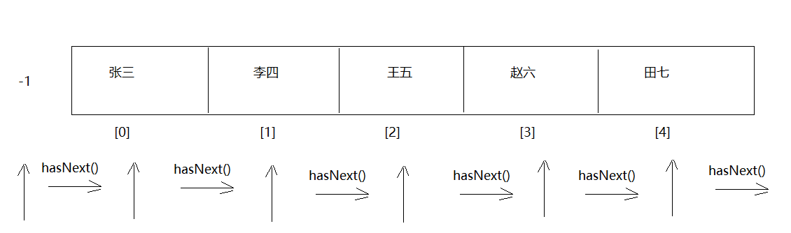

## 迭代器底层原理

```java
1.获取Iterator的时候怎么获取的:
  Iterator iterator = list.iterator()
  我们知道Iterator是一个接口,等号右边一定是它的实现类对象
  问题:Iterator接收的到底是哪个实现类对象呢? -> ArrayList中的内部类Itr对象    
```

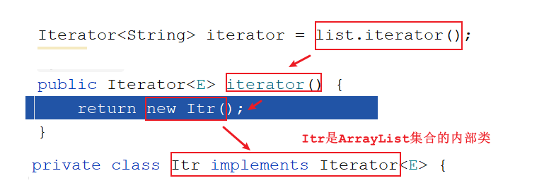

> 注意:只有ArrayList使用迭代器的时候Iterator接口才会指向Itr,其他的集合使用迭代器Iterator就指向的不是Itr了
>
> ```java
> HashSet<String> set = new HashSet<>();
> Iterator<String> iterator1 = set.iterator();
> ```
>
> 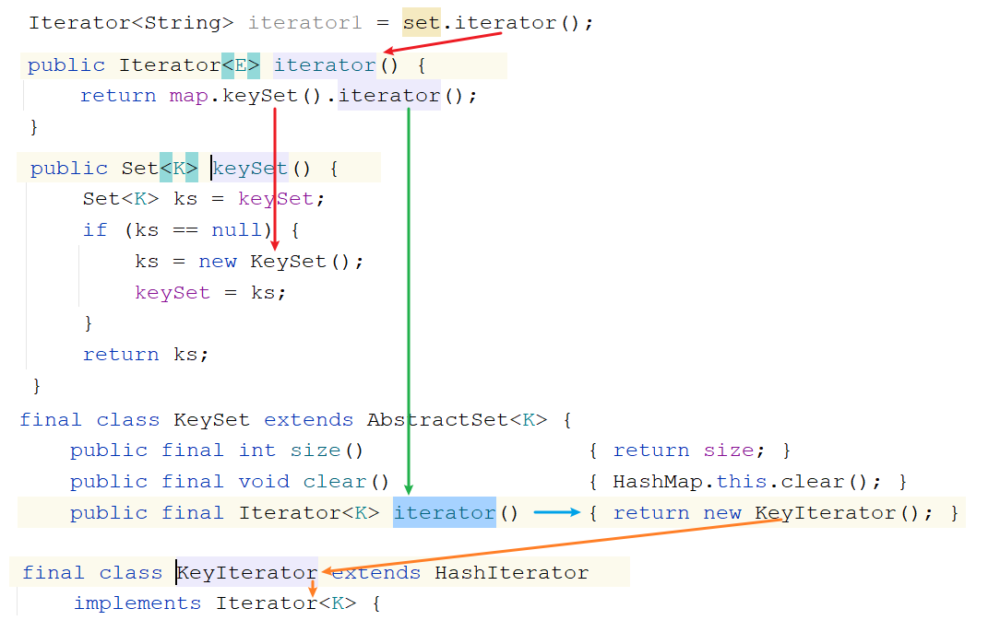

## 并发修改异常

```java
需求:定义一个集合,存储 唐僧,孙悟空,猪八戒,沙僧,遍历集合,如果遍历到猪八戒,往集合中添加一个白龙马
```

```java
public class Demo03Iterator {
    public static void main(String[] args) {
        //需求:定义一个集合,存储 唐僧,孙悟空,猪八戒,沙僧,遍历集合,如果遍历到猪八戒,往集合中添加一个白龙马
        ArrayList<String> list = new ArrayList<>();
        list.add("唐僧");
        list.add("孙悟空");
        list.add("猪八戒");
        list.add("沙僧");

        Iterator<String> iterator = list.iterator();
        while(iterator.hasNext()){
            String element = iterator.next();
            if ("猪八戒".equals(element)){
                list.add("白龙马");
            }
        }
        System.out.println(list);
    }
}
```

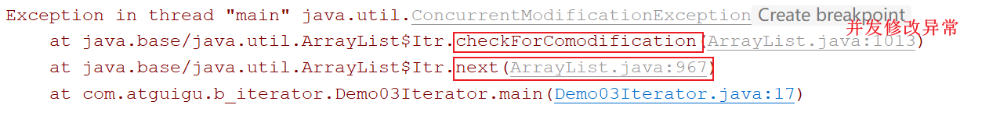

```java
String element = iterator.next();
=========================================
private class Itr implements Iterator<E> {
        int cursor;       // index of next element to return
        int lastRet = -1; // index of last element returned; -1 if no such
    
        /*
          modCount: 实际操作次数
          expectedModCount:预期操作次数
        */
        int expectedModCount = modCount;
    
        @SuppressWarnings("unchecked")
        public E next() {
            checkForComodification();
        } 
    
        final void checkForComodification() {
            if (modCount != expectedModCount)
                throw new ConcurrentModificationException();
        }
}    
```

```java
结论:当预期操作次数和实际操作次数不相等了,会出现"并发修改异常"
```

```java
我们干了什么事儿,让实际操作次数和预期操作次数不相等了
```

```java
list.add("白龙马")
====================================
public boolean add(E e) {
    modCount++;//实际操作次数+1
}  
====================================
最终结论:我们调用了add方法,而add方法底层只给modCount++,但是再次调用next方法的时候,并没有给修改后的modCount重新赋值给expectedModCount,导致next方法底层的判断判断出实际操作次数和预期操作次数不相等了,所以抛出了"并发修改异常"    
```

> ArrayList中的方法:ListIterator<E> listIterator()  
>
> ```java
> public class Demo03Iterator {
>     public static void main(String[] args) {
>         //需求:定义一个集合,存储 唐僧,孙悟空,猪八戒,沙僧,遍历集合,如果遍历到猪八戒,往集合中添加一个白龙马
>         ArrayList<String> list = new ArrayList<>();
>         list.add("唐僧");
>         list.add("孙悟空");
>         list.add("猪八戒");
>         list.add("沙僧");
> 
>         //Iterator<String> iterator = list.iterator();
>         ListIterator<String> listIterator = list.listIterator();
>         while(listIterator.hasNext()){
>             String element = listIterator.next();
>             if ("猪八戒".equals(element)){
>                 listIterator.add("白龙马");
>             }
>         }
>         System.out.println(list);
>     }
> }
> ```
>
> 使用迭代器迭代集合的过程中,不要随意修改集合长度,容易出现并发修改异常

# 数据结构

```properties
数据结构是一种具有一定逻辑关系，在计算机中应用某种存储结构，并且封装了相应操作的数据元素集合。它包含三方面的内容，逻辑关系、存储关系及操作。
```

### 为什么需要数据结构

```properties
随着应用程序变得越来越复杂和数据越来越丰富，几百万、几十亿甚至几百亿的数据就会出现，而对这么大对数据进行搜索、插入或者排序等的操作就越来越慢，数据结构就是用来解	决这些问题的。
```

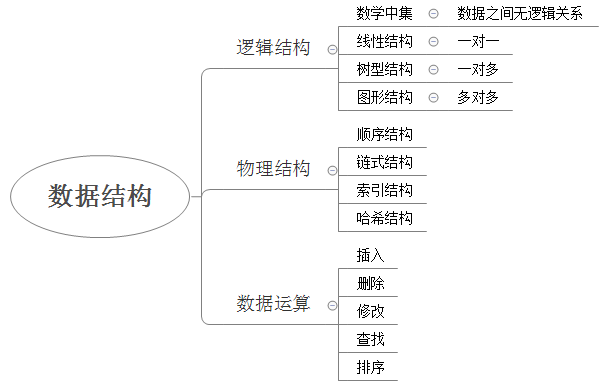

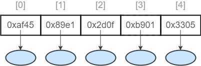


数据的逻辑结构指反映数据元素之间的逻辑关系，而与他们在计算机中的存储位置无关：

* 集合（数学中集合的概念）：数据结构中的元素之间除了“同属一个集合” 的相互关系外，别无其他关系；
* 线性结构：数据结构中的元素存在一对一的相互关系；
* 树形结构：数据结构中的元素存在一对多的相互关系；
* 图形结构：数据结构中的元素存在多对多的相互关系。

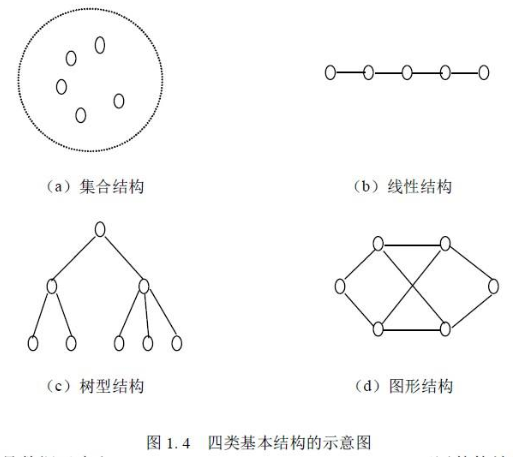

数据的物理结构/存储结构：是描述数据具体在内存中的存储（如：顺序结构、链式结构、索引结构、哈希结构）等，一种数据逻辑结构可表示成一种或多种物理存储结构。

数据结构是一门完整并且复杂的课程，那么我们今天只是简单的讨论常见的几种数据结构，让我们对数据结构与算法有一个初步的了解。

## 栈

```java
1.特点:
  先进后出
2.好比:手枪压子弹      
```

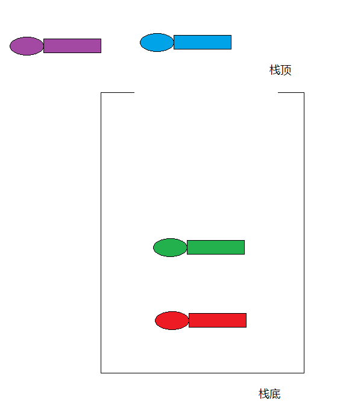

## 队列

```java
1.特点:先进先出
2.好比:过安检    
```

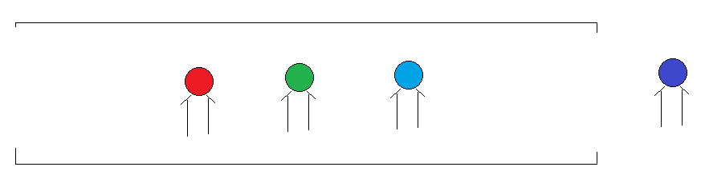

## 数组

```java
1.特点:查询快,增删慢
2.查询快:因为有索引,我们可以直接通过索引操作元素
  增删慢:因为数组定长
        a.添加元素:创建新数组,将老数组中的元素复制到新数组中去,在最后添加新元素;要是从中间插入就更麻烦了
                  插入完新元素,后面的元素都要往后移动
        b.删除元素:创建新数组,将老数组中的元素复制到新数组中去,被删除的元素就不复制了;如果要是从之间删除
                  被删除的元素后面的元素都要往前移动
```

## 链表

```java
1.在集合中涉及到了两种链表
2.单向链表
  a.节点:一个节点分为两部分
    第一部分:数据域(存数据)
    第二部分:指针域(保存下一个节点地址)
  b.特点:前面节点记录后面节点的地址,但是后面节点地址不记录前面节点地址
      
3.双向链表:
  a.节点:一个节点分为三部分
    第一部分:指针域(保存上一个节点地址)
    第二部分:数据域(保存的数据)
    第三部分:指针域(保存下一个节点地址)
  b.特点:
    前面节点记录后面节点地址,后面节点也记录前面节点地址
        
4.链表结构特点:查询慢,增删快        
```

### 单向链表

```java
a.节点:一个节点分为两部分
  第一部分:数据域(存数据)
  第二部分:指针域(保存下一个节点地址)
b.特点:前面节点记录后面节点的地址,但是后面节点地址不记录前面节点地址
```

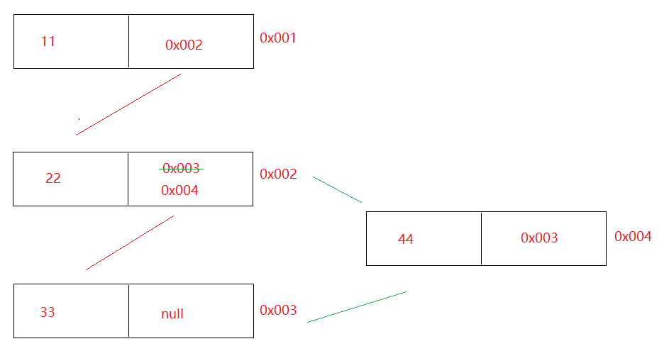

### 双向链表

```java
  a.节点:一个节点分为三部分
    第一部分:指针域(保存上一个节点地址)
    第二部分:数据域(保存的数据)
    第三部分:指针域(保存下一个节点地址)
  b.特点:
    前面节点记录后面节点地址,后面节点也记录前面节点地址
```

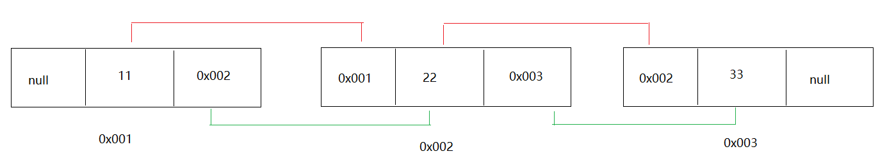

# List接口

```java
1.概述:是Collection接口的子接口
2.常见的实现类:
  ArrayList LinkedList Vector
```

# List集合下的实现类

## ArrayList集合

```java
1.概述:ArrayList是List接口的实现类
2.特点:
  a.元素有序-> 按照什么顺序存的,就按照什么顺序取
  b.元素可重复
  c.有索引-> 可以利用索引去操作元素
  d.线程不安全
      
3.数据结构:数组       
4.常用方法:
  boolean add(E e)  -> 将元素添加到集合中->尾部(add方法一定能添加成功的,所以我们不用boolean接收返回值)
  void add(int index, E element) ->在指定索引位置上添加元素
  boolean remove(Object o) ->删除指定的元素,删除成功为true,失败为false
  E remove(int index) -> 删除指定索引位置上的元素,返回的是被删除的那个元素
  E set(int index, E element) -> 将指定索引位置上的元素,修改成后面的element元素
  E get(int index) -> 根据索引获取元素
  int size()  -> 获取集合元素个数
```

### ArrayList集合使用

```java
public class Demo01ArrayList {
    public static void main(String[] args) {
        ArrayList<String> list = new ArrayList<>();
        //boolean add(E e)  -> 将元素添加到集合中->尾部(add方法一定能添加成功的,所以我们不用boolean接收返回值)
        list.add("铁胆火车侠");
        list.add("喜洋洋");
        list.add("火影忍者");
        list.add("灌篮高手");
        list.add("网球王子");
        System.out.println(list);
        //void add(int index, E element) ->在指定索引位置上添加元素
        list.add(2,"涛哥");
        System.out.println(list);
        //boolean remove(Object o) ->删除指定的元素,删除成功为true,失败为false
        list.remove("涛哥");
        System.out.println(list);
        //E remove(int index) -> 删除指定索引位置上的元素,返回的是被删除的那个元素
        String element = list.remove(0);
        System.out.println(element);
        System.out.println(list);
        //E set(int index, E element) -> 将指定索引位置上的元素,修改成后面的element元素
        String element2 = list.set(0, "金莲");
        System.out.println(element2);
        System.out.println(list);
        //E get(int index) -> 根据索引获取元素
        System.out.println(list.get(0));
        //int size()  -> 获取集合元素个数
        System.out.println(list.size());
    }
}
```

```java
public class Demo02ArrayList {
    public static void main(String[] args) {
        ArrayList<String> list = new ArrayList<>();
        list.add("铁胆火车侠");
        list.add("喜洋洋");
        list.add("火影忍者");
        list.add("灌篮高手");
        list.add("网球王子");

        Iterator<String> iterator = list.iterator();
        while(iterator.hasNext()){
            System.out.println(iterator.next());
        }

        System.out.println("=====================");

        for (int i = 0;i<list.size();i++){
            System.out.println(list.get(i));
        }

        System.out.println("=====================");
        /*
           遍历带有索引集合的快捷键
             集合名.fori
         */
        for (int i = 0; i < list.size(); i++) {
            System.out.println(list.get(i));
        }

    }
}
```

>  ```java
>  public class Demo03ArrayList {
>      public static void main(String[] args) {
>          ArrayList<Integer> list = new ArrayList<>();
>          list.add(2);
>          System.out.println(list);
>  
>          /*
>            需求:删除2
>            remove(Object o) -> 直接删除指定元素
>            remove(int index) -> 删除指定索引位置上的元素
>  
>            如果remove中直接传递整数,默认调用按照指定索引删除元素的remove
>            但是此时list中没有2索引,所以越界
>  
>            解决:我们可以将2包装成包装类,变成包装类之后,其父类就是Object了,
>  
>  
>           */
>          //list.remove(2);
>          list.remove(Integer.valueOf(2));
>          System.out.println(list);
>      }
>  }
>  
>  ```

### 底层源码分析

```java
1.ArrayList构造方法:
  a.ArrayList() 构造一个初始容量为十的空列表
  b.ArrayList(int initialCapacity) 构造具有指定初始容量的空列表 
      
2.ArrayList源码总结:
  a.不是一new底层就会创建初始容量为10的空列表,而是第一次add的时候才会创建初始化容量为10的空列表
  b.ArrayList底层是数组,那么为啥还说集合长度可变呢?
    ArrayList底层会自动扩容-> Arrays.copyOf    
  c.扩容多少倍?
    1.5倍
```

```java
ArrayList() 构造一个初始容量为十的空列表
=========================================
private static final Object[] DEFAULTCAPACITY_EMPTY_ELEMENTDATA = {};
Object[] elementData; ->ArrayList底层的那个数组
    
public ArrayList() {
    this.elementData = DEFAULTCAPACITY_EMPTY_ELEMENTDATA;
}   

=========================================
list.add("a");

public boolean add(E e) {
    modCount++;
    add(e, elementData, size);// e->要存的元素  elementData->集合数组,长度开始为0,size->0
    return true;
}

private void add(E e->元素, Object[] elementData->集合数组, int s->0) {
    if (s == elementData.length)
        elementData = grow();
    elementData[s] = e;
    size = s + 1;
}

private Object[] grow() {
    return grow(size + 1);
}

private Object[] grow(int minCapacity->1) {
    int oldCapacity = elementData.length;//0
    if (oldCapacity > 0 || elementData != DEFAULTCAPACITY_EMPTY_ELEMENTDATA) {
        int newCapacity = ArraysSupport.newLength(oldCapacity,
                minCapacity - oldCapacity, /* minimum growth */
                oldCapacity >> 1           /* preferred growth */);
        return elementData = Arrays.copyOf(elementData, newCapacity);
    } else {
        return elementData = new Object[Math.max(DEFAULT_CAPACITY->10, minCapacity->1)];
    }
}
==========================================
假设ArrayList中存了第11个元素,会自动扩容-> Arrays.copyOf

private Object[] grow(int minCapacity) {//11
    int oldCapacity = elementData.length;//10
    if (oldCapacity > 0 || elementData != DEFAULTCAPACITY_EMPTY_ELEMENTDATA) {
        int newCapacity(15) = ArraysSupport.newLength(oldCapacity->10,
                minCapacity - oldCapacity->1, /* minimum growth */
                oldCapacity >> 1 ->5          /* preferred growth */);
        return elementData = Arrays.copyOf(elementData, newCapacity);
    } else {
        return elementData = new Object[Math.max(DEFAULT_CAPACITY, minCapacity)];
    }
}    


public static int newLength(int oldLength->10, int minGrowth->1, int prefGrowth->5) {
        // preconditions not checked because of inlining
        // assert oldLength >= 0
        // assert minGrowth > 0

        int prefLength = oldLength + Math.max(minGrowth, prefGrowth); // 15
        if (0 < prefLength && prefLength <= SOFT_MAX_ARRAY_LENGTH) {
            return prefLength;
        } else {
            // put code cold in a separate method
            return hugeLength(oldLength, minGrowth);
        }
}
```

```java
 ArrayList(int initialCapacity) 构造具有指定初始容量的空列表 
```

```java
ArrayList<String> list = new ArrayList<>(5);
==============================================
public ArrayList(int initialCapacity->5) {
    if (initialCapacity > 0) {
        this.elementData = new Object[initialCapacity];//直接创建长度为5的数组
    } else if (initialCapacity == 0) {
        this.elementData = EMPTY_ELEMENTDATA;
    } else {
        throw new IllegalArgumentException("Illegal Capacity: "+
                                           initialCapacity);
    }
}    
```

> ArrayList\<String>  list = new  ArrayList\<String>() -> 现在我们想用都是new
>
> 但是将来开发不会想使用就new集合,都是调用一个方法,查询出很多数据来,此方法返回一个集合,自动将查询出来的数据放到集合中,我们想在页面上展示数据,遍历集合
>
> 而且将来调用方法,返回的集合类型,一般都是接口类型
>
> List<泛型> list = 对象.查询方法()

# LinkedList集合

```java
1.概述:LinkedList是List接口的实现类
2.特点:
  a.元素有序
  b.元素可重复
  c.有索引 -> 这里说的有索引仅仅指的是有操作索引的方法,不代表本质上具有索引
  d.线程不安全
      
3.数据结构:双向链表      
    
4.方法:有大量直接操作首尾元素的方法
  - public void addFirst(E e):将指定元素插入此列表的开头。
  - public void addLast(E e):将指定元素添加到此列表的结尾。
  - public E getFirst():返回此列表的第一个元素。
  - public E getLast():返回此列表的最后一个元素。
  - public E removeFirst():移除并返回此列表的第一个元素。
  - public E removeLast():移除并返回此列表的最后一个元素。
  - public E pop():从此列表所表示的堆栈处弹出一个元素。
  - public void push(E e):将元素推入此列表所表示的堆栈。
  - public boolean isEmpty()：如果列表没有元素，则返回true。
```

```java
public class Demo05LinkedList {
    public static void main(String[] args) {
        LinkedList<String> linkedList = new LinkedList<>();
        linkedList.add("吕布");
        linkedList.add("刘备");
        linkedList.add("关羽");
        linkedList.add("张飞");
        linkedList.add("貂蝉");
        System.out.println(linkedList);

        linkedList.addFirst("孙尚香");
        System.out.println(linkedList);

        linkedList.addLast("董卓");
        System.out.println(linkedList);

        System.out.println(linkedList.getFirst());
        System.out.println(linkedList.getLast());

        linkedList.removeFirst();
        System.out.println(linkedList);

        linkedList.removeLast();
        System.out.println(linkedList);

        System.out.println("======================");

        Iterator<String> iterator = linkedList.iterator();
        while(iterator.hasNext()){
            System.out.println(iterator.next());
        }

        System.out.println("=======================");
        for (int i = 0; i < linkedList.size(); i++) {
            System.out.println(linkedList.get(i));
        }
    }
}

```

```java
public E pop():从此列表所表示的堆栈处弹出一个元素。
public void push(E e):将元素推入此列表所表示的堆栈。
```

```java
public class Demo06LinkedList {
    public static void main(String[] args) {
        LinkedList<String> linkedList = new LinkedList<>();
        linkedList.add("吕布");
        linkedList.add("刘备");
        linkedList.add("关羽");
        linkedList.add("张飞");
        linkedList.add("貂蝉");

        //public E pop():从此列表所表示的堆栈处弹出一个元素。
        linkedList.pop();
        System.out.println(linkedList);
        //public void push(E e):将元素推入此列表所表示的堆栈。
        linkedList.push("涛哥");
        System.out.println(linkedList);
    }
}
```

## LinkedList底层成员解释说明

```java
1.LinkedList底层成员
  transient int size = 0;  元素个数
  transient Node<E> first; 第一个节点对象
  transient Node<E> last;  最后一个节点对象
  
2.Node代表的是节点对象
   private static class Node<E> {
        E item;//节点上的元素
        Node<E> next;//记录着下一个节点地址
        Node<E> prev;//记录着上一个节点地址

        Node(Node<E> prev, E element, Node<E> next) {
            this.item = element;
            this.next = next;
            this.prev = prev;
        }
    }
```

## LinkedList中add方法源码分析

```java
LinkedList<String> list = new LinkedList<>();
list.add("a");
list.add("b");    

void linkLast(E e) {
        final Node<E> l = last;
        final Node<E> newNode = new Node<>(l, e, null);
        last = newNode;
        if (l == null)
            first = newNode;
        else
            l.next = newNode;
        size++;
        modCount++;
}
```

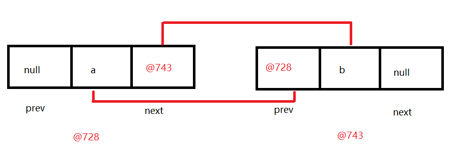

## LinkedList中get方法源码分析

```java
public E get(int index) {
    checkElementIndex(index);
    return node(index).item;
} 

Node<E> node(int index) {
    // assert isElementIndex(index);

    if (index < (size >> 1)) {
        Node<E> x = first;
        for (int i = 0; i < index; i++)
            x = x.next;
        return x;
    } else {
        Node<E> x = last;
        for (int i = size - 1; i > index; i--)
            x = x.prev;
        return x;
    }
}
```

```java
index < (size >> 1)采用二分思想，先将index与长度size的一半比较，如果index<size/2，就只从位置0往后遍历到位置index处，而如果index>size/2，就只从位置size往前遍历到位置index处。这样可以减少一部分不必要的遍历
```

# 增强for

## 基本使用

```java
1.作用:
  遍历集合或者数组
2.格式:
  for(元素类型 变量名:要遍历的集合名或者数组名){
      变量名就是代表的每一个元素
  }

3.快捷键:集合名或者数组名.for
```

```java
public class Demo01ForEach {
    public static void main(String[] args) {
        ArrayList<String> list = new ArrayList<>();
        list.add("张三");
        list.add("李四");
        list.add("王五");
        list.add("赵六");
        for (String s : list) {
            System.out.println(s);
        }

        System.out.println("=====================");

        int[] arr = {1,2,3,4,5};
        for (int i : arr) {
            System.out.println(i);
        }
    }
}
```

## 注意

```java
1.增强for遍历集合时,底层实现原理为迭代器
2.增强for遍历数组时,底层实现原理为普通for
```

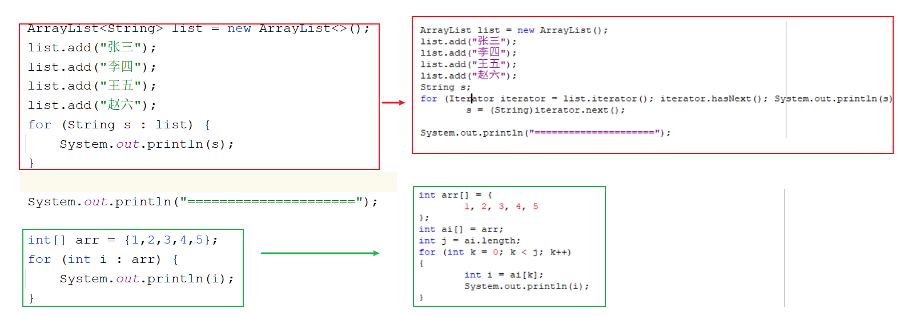

> 所以不管是用迭代器还是使用增强for,在遍历集合的过程中都不要随意修改集合长度,否则会出现并发修改异常

# 模块十八总结及模块十九重点

```
模块18回顾:
  1.Collection集合:单列集合的顶级接口
    a.add  addAll  clear size  isEmpty  remove  toArray  contains
  2.迭代器:Iterator
    a.获取:iterator方法
    b.方法:
      hasNext()
      next()
    c.并发修改异常:在迭代集合的时候,不能随意修改集合长度
      原因:调用add,只给实际操作次数+1.后面调用next的时候,没有给预期操作次数重新赋值,导致预期操作次数和实际操作次数不相等了
          
   3.数据结构:
     栈:先进后出
     队列:先进先出
     数组:查询快,增删慢
     链表:查询慢,增删快
         
   4.ArrayList
     a.特点:
       元素有序,有索引,元素可重复,线程不安全
     b.数据结构:
       数组
     c.方法:
       add(元素)直接在最后添加元素
       add(索引,元素)在指定索引位置上添加元素
       remove(元素)删除指定元素
       remove(索引)按照指定索引删除元素
       size()获取元素个数
       get(索引)根据索引获取元素
       set(索引,元素)将指定索引位置上的元素修改成我们指定的元素
     d.利用无参构造创建集合对象,第一次add时,会创建一个长度为10的空数组
       超出范围,自动扩容->Arrays.copyOf
       扩容1.5倍
           
   5.LinkedList
     a.特点: 元素有序 有索引(java提供了按照索引操作元素的方法,并不代表本质上拥有索引),元素可重复,线程不安全
         
     b.数据结构:双向链表
     c.方法:有大量直接操作收尾元素的方法
         
   6.增强for:
     a.格式:
       for(元素类型 变量名:集合名或者数组名){
           变量就代表每一个元素
       }

     b.原理:
       遍历集合时,原理为迭代器
       遍历数组时,原理为普通for
           
模块19重点:
  1.会Collections集合工具类的常用方法
  2.会使用泛型
  3.知道HashSet和LinkedHashSet的特点以及使用
  4.知道HashSet将元素去重复的过程       
```

# Collections集合工具类

```java
1.概述:集合工具类
2.特点:
  a.构造私有
  b.方法都是静态的
      
3.使用:类名直接调用
    
4.方法:
  static <T> boolean addAll(Collection<? super T> c, T... elements)->批量添加元素 
  static void shuffle(List<?> list) ->将集合中的元素顺序打乱
  static <T> void sort(List<T> list) ->将集合中的元素按照默认规则排序
  static <T> void sort(List<T> list, Comparator<? super T> c)->将集合中的元素按照指定规则排序 
```

```java
public class Demo01Collections {
    public static void main(String[] args) {
        ArrayList<String> list = new ArrayList<>();
        //static <T> boolean addAll(Collection<? super T> c, T... elements)->批量添加元素
        Collections.addAll(list,"张三","李四","王五","赵六","田七","朱八");
        System.out.println(list);
        //static void shuffle(List<?> list) ->将集合中的元素顺序打乱
        Collections.shuffle(list);
        System.out.println(list);
        //static <T> void sort(List<T> list) ->将集合中的元素按照默认规则排序-> ASCII码表
        ArrayList<String> list1 = new ArrayList<>();
        list1.add("c.举头望明月");
        list1.add("a.床前明月光");
        list1.add("d.低头思故乡");
        list1.add("b.疑是地上霜");
        Collections.sort(list1);
        System.out.println(list1);
    }
}
```

```java
1.方法:static <T> void sort(List<T> list, Comparator<? super T> c)->将集合中的元素按照指定规则排序
    
2.Comparator比较器
  a.方法:
    int compare(T o1,T o2)
                o1-o2 -> 升序
                o2-o1 -> 降序    
```

```java
public class Person {
    private String name;
    private Integer age;

    public Person() {
    }

    public Person(String name, Integer age) {
        this.name = name;
        this.age = age;
    }

    public String getName() {
        return name;
    }

    public void setName(String name) {
        this.name = name;
    }

    public Integer getAge() {
        return age;
    }

    public void setAge(Integer age) {
        this.age = age;
    }

    @Override
    public String toString() {
        return "Person{" +
                "name='" + name + '\'' +
                ", age=" + age +
                '}';
    }
}

```

```java
public class Demo02Collections {
    public static void main(String[] args) {
        ArrayList<Person> list = new ArrayList<>();
        list.add(new Person("柳岩",18));
        list.add(new Person("涛哥",16));
        list.add(new Person("金莲",20));

        Collections.sort(list, new Comparator<Person>() {
            @Override
            public int compare(Person o1, Person o2) {
                return o1.getAge()-o2.getAge();
            }
        });

        System.out.println(list);
    }
}
```

```java
1.接口:Comparable接口
2.方法: int compareTo(T o) -> this-o (升序)   o-this(降序)
```

```java
public class Student implements Comparable<Student>{
    private String name;
    private Integer score;

    public Student() {
    }

    public Student(String name, Integer score) {
        this.name = name;
        this.score = score;
    }

    public String getName() {
        return name;
    }

    public void setName(String name) {
        this.name = name;
    }

    public Integer getScore() {
        return score;
    }

    public void setScore(Integer score) {
        this.score = score;
    }

    @Override
    public String toString() {
        return "Student{" +
                "name='" + name + '\'' +
                ", score=" + score +
                '}';
    }

    @Override
    public int compareTo(Student o) {
        return this.getScore()-o.getScore();
    }
}
```

```java
public class Demo03Collections {
    public static void main(String[] args) {
        ArrayList<Student> list = new ArrayList<>();
        list.add(new Student("涛哥",100));
        list.add(new Student("柳岩",150));
        list.add(new Student("三上",80));
        Collections.sort(list);
        System.out.println(list);
    }
}
```

```
Arrays中的静态方法:
static <T> List<T> asList(T...a) -> 直接指定元素,转存到list集合中
```

```java
public class Demo04Collections {
    public static void main(String[] args) {
        List<String> list = Arrays.asList("张三", "李四", "王五");
        System.out.println(list);
    }
}
```


# 泛型

```java
1.泛型:<>
2.作用:
  统一数据类型,防止将来的数据转换异常
3.注意:
  a.泛型中的类型必须是引用类型
  b.如果泛型不写,默认类型为Object    
```

## 为什么要使用泛型

```java
1.从使用层面上来说:
  统一数据类型,防止将来的数据类型转换异常
2.从定义层面上来看:
  定义带泛型的类,方法等,将来使用的时候给泛型确定什么类型,泛型就会变成什么类型,凡是涉及到泛型的都会变成确定的类型,代码更灵活
```

```java
public class Demo01Genericity {
    public static void main(String[] args) {
        ArrayList list = new ArrayList();
        list.add("1");
        list.add(1);
        list.add("abc");
        list.add(2.5);
        list.add(true);

        //获取元素中为String类型的字符串长度
        for (Object o : list) {
            String s = (String) o;
            System.out.println(s.length());//ClassCastException
           
        }
    }
}
```

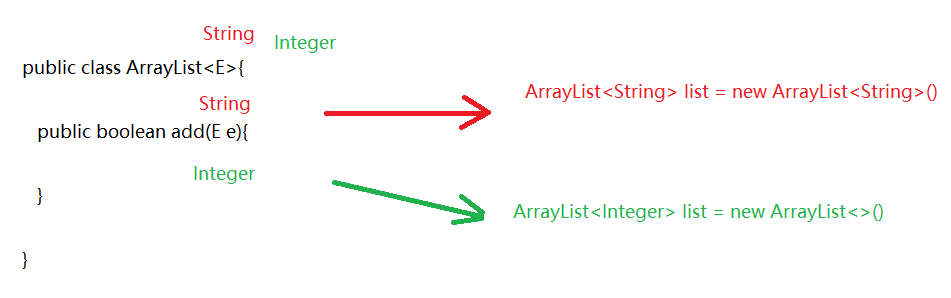

## 泛型的定义

### 含有泛型的类

```java
1.定义:
   public class 类名<E>{
       
   }

2.什么时候确定类型
  new对象的时候确定类型  
```

```java
public class MyArrayList <E>{
    //定义一个数组,充当ArrayList底层的数组,长度直接规定为10
    Object[] obj = new Object[10];
    //定义size,代表集合元素个数
    int size;

    /**
     * 定义一个add方法,参数类型需要和泛型类型保持一致
     *
     * 数据类型为E  变量名随便取
     */
    public boolean add(E e){
        obj[size] = e;
        size++;
        return true;
    }

    /**
     * 定义一个get方法,根据索引获取元素
     */
    public E get(int index){
        return (E) obj[index];
    }

    @Override
    public String toString() {
        return Arrays.toString(obj);
    }
}
```

```java
public class Demo02Genericity {
    public static void main(String[] args) {
        MyArrayList<String> list1 = new MyArrayList<>();
        list1.add("aaa");
        list1.add("bbb");
        System.out.println(list1);//直接输出对象名,默认调用toString

        System.out.println("===========");

        MyArrayList<Integer> list2 = new MyArrayList<>();
        list2.add(1);
        list2.add(2);
        Integer element = list2.get(0);
        System.out.println(element);
        System.out.println(list2);
    }
}
```

### 含有泛型的方法

```java
1.格式:
  修饰符 <E> 返回值类型 方法名(E e)
      
2.什么时候确定类型
  调用的时候确定类型
```

```java
public class ListUtils {
    //定义一个静态方法addAll,添加多个集合的元素
    public static <E> void addAll(ArrayList<E> list,E...e){
        for (E element : e) {
            list.add(element);
        }
    }

}
```

```java
public class Demo03Genericity {
    public static void main(String[] args) {
        ArrayList<String> list1 = new ArrayList<>();
        ListUtils.addAll(list1,"a","b","c");
        System.out.println(list1);

        System.out.println("================");

        ArrayList<Integer> list2 = new ArrayList<>();
        ListUtils.addAll(list2,1,2,3,4,5);
        System.out.println(list2);
    }
}
```

### 含有泛型的接口

```java
1.格式:
  public interface 接口名<E>{
      
  }
2.什么时候确定类型:
  a.在实现类的时候还没有确定类型,只能在new实现类的时候确定类型了 ->比如 ArrayList
  b.在实现类的时候直接确定类型了 -> 比如Scanner    
```

```java
public interface MyList <E>{
    public boolean add(E e);
}
```

```java
public class MyArrayList1<E> implements MyList<E>{
    //定义一个数组,充当ArrayList底层的数组,长度直接规定为10
    Object[] obj = new Object[10];
    //定义size,代表集合元素个数
    int size;

    /**
     * 定义一个add方法,参数类型需要和泛型类型保持一致
     *
     * 数据类型为E  变量名随便取
     */
    public boolean add(E e){
        obj[size] = e;
        size++;
        return true;
    }

    /**
     * 定义一个get方法,根据索引获取元素
     */
    public E get(int index){
        return (E) obj[index];
    }

    @Override
    public String toString() {
        return Arrays.toString(obj);
    }
}
```

```java
public class Demo04Genericity {
    public static void main(String[] args) {
        MyArrayList1<String> list1 = new MyArrayList1<>();
        list1.add("张三");
        list1.add("李四");
        System.out.println(list1.get(0));

    }
}
```

```java
public interface MyIterator <E>{
    E next();
}

public class MyScanner implements MyIterator<String>{
    @Override
    public String next() {
        return "涛哥和金莲的故事";
    }
}

```

```java
public class Demo05Genericity {
    public static void main(String[] args) {
        MyScanner myScanner = new MyScanner();
        String result = myScanner.next();
        System.out.println("result = " + result);
    }
}
```

## 泛型的高级使用

### 泛型通配符 ?

```java
public class Demo01Genericity {
    public static void main(String[] args) {
        ArrayList<String> list1 = new ArrayList<>();
        list1.add("张三");
        list1.add("李四");

        ArrayList<Integer> list2 = new ArrayList<>();
        list2.add(1);
        list2.add(2);
        
        method(list1);
        method(list2);
    }
    
    public static void method(ArrayList<?> list){
        for (Object o : list) {
            System.out.println(o);
        }
    }

}
```

###  泛型的上限下限

```java
1.作用:可以规定泛型的范围
2.上限:
  a.格式:<? extends 类型>
  b.含义:?只能接收extends后面的本类类型以及子类类型    
3.下限:
  a.格式:<? super 类型>
  b.含义:?只能接收super后面的本类类型以及父类类型    
```

```java
/**
 * Integer -> Number -> Object
 * String -> Object
 */
public class Demo02Genericity {
    public static void main(String[] args) {
        ArrayList<Integer> list1 = new ArrayList<>();
        ArrayList<String> list2 = new ArrayList<>();
        ArrayList<Number> list3 = new ArrayList<>();
        ArrayList<Object> list4 = new ArrayList<>();

        get1(list1);
        //get1(list2);错误
        get1(list3);
        //get1(list4);错误

        System.out.println("=================");

        //get2(list1);错误
        //get2(list2);错误
        get2(list3);
        get2(list4);
    }

    //上限  ?只能接收extends后面的本类类型以及子类类型
    public static void get1(Collection<? extends Number> collection){

    }

    //下限  ?只能接收super后面的本类类型以及父类类型
    public static void get2(Collection<? super Number> collection){

    }
}
```

> 应用场景:
>
> 1.如果我们在定义类,方法,接口的时候,如果类型不确定,我们可以考虑定义含有泛型的类,方法,接口
>
> 2.如果类型不确定,但是能知道以后只能传递某个类的继承体系中的子类或者父类,就可以使用泛型的通配符

# 斗地主案例(扩展案例)

## 案例介绍

按照斗地主的规则，完成洗牌发牌的动作。
具体规则：

使用54张牌打乱顺序,三个玩家参与游戏，三人交替摸牌，每人17张牌，最后三张留作底牌。

## 案例分析

**准备牌：**

牌可以设计为一个ArrayList\<String>,每个字符串为一张牌。
每张牌由花色数字两部分组成，我们可以使用花色集合与数字集合嵌套迭代完成每张牌的组装。
牌由Collections类的shuffle方法进行随机排序。

**发牌：**

将每个人以及底牌设计为ArrayList\<String>,将最后3张牌直接存放于底牌，剩余牌通过对3取模依次发牌。

**看牌：**

直接打印每个集合。

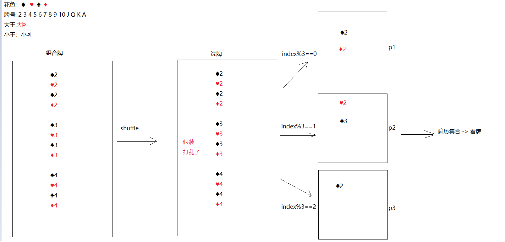

## 代码实现

```java
1.创建ArrayList集合-> color -> 专门存花色
2.创建一个ArrayList集合 -> number -> 专门存牌号
3.创建一个ArrayList集合 -> poker -> 专门存花色和牌号组合好的牌面
4.打乱poker
5.创建4个ArrayList集合,分别代表三个玩家,以及存储一个底牌
6.如果index为最后三张,往dipai集合中存
7.如果index%3==0 给p1
8.如果index%3==1 给p2
9.如果index%3==2 给p3
10.遍历看牌
```
**实现方式一:**

```java
public class Poker {
    public static void main(String[] args) {
        //1.创建ArrayList集合-> color -> 专门存花色
        ArrayList<String> color = new ArrayList<>();
        //2.创建一个ArrayList集合 -> number -> 专门存牌号
        ArrayList<String> number = new ArrayList<>();
        //3.创建一个ArrayList集合 -> poker -> 专门存花色和牌号组合好的牌面
        ArrayList<String> poker = new ArrayList<>();

        color.add("♠");
        color.add("♥");
        color.add("♣");
        color.add("♦");

        for (int i = 2; i <= 10; i++) {
            number.add(i + "");
        }

        number.add("J");
        number.add("Q");
        number.add("K");
        number.add("A");

        //System.out.println(color);
        //System.out.println(number);

        for (String num : number) {
            for (String huaSe : color) {
                String pokerNumber = huaSe + num;
                poker.add(pokerNumber);
            }
        }

        poker.add("😊");
        poker.add("☺");
        //System.out.println(poker);

        //4.打乱poker
        Collections.shuffle(poker);
        //System.out.println(poker);
        //5.创建4个ArrayList集合,分别代表三个玩家,以及存储一个底牌
        ArrayList<String> p1 = new ArrayList<>();
        ArrayList<String> p2 = new ArrayList<>();
        ArrayList<String> p3 = new ArrayList<>();
        ArrayList<String> dipai = new ArrayList<>();
        for (int i = 0; i < poker.size(); i++) {
            String s = poker.get(i);
            //6.如果index为最后三张,往dipai集合中存
            if (i >= 51) {
                dipai.add(s);
                //7.如果index%3==0 给p1
            } else if (i % 3 == 0) {
                p1.add(s);
                //8.如果index%3==1 给p2
            } else if (i % 3 == 1) {
                p2.add(s);
                //9.如果index%3==2 给p3
            }else if (i%3==2){
                p3.add(s);
            }
        }

        //10.遍历看牌
        System.out.println("涛哥:"+p1);
        System.out.println("三上:"+p2);
        System.out.println("金莲:"+p3);
        System.out.println("底牌:"+dipai);
    }
}
```
**实现方式二：**

```java
public class Poker1 {
    public static void main(String[] args) {
        //1.创建数组-> color -> 专门存花色
        String[] color = "♠-♥-♣-♦".split("-");
        //2.创建数组 -> number -> 专门存牌号
        String[] number = "2-3-4-5-6-7-8-9-10-J-Q-K-A".split("-");
        //3.创建一个ArrayList集合 -> poker -> 专门存花色和牌号组合好的牌面
        ArrayList<String> poker = new ArrayList<>();

        //System.out.println(color);
        //System.out.println(number);

        for (String num : number) {
            for (String huaSe : color) {
                String pokerNumber = huaSe + num;
                poker.add(pokerNumber);
            }
        }

        poker.add("😊");
        poker.add("☺");
        //System.out.println(poker);

        //4.打乱poker
        Collections.shuffle(poker);
        //System.out.println(poker);
        //5.创建4个ArrayList集合,分别代表三个玩家,以及存储一个底牌
        ArrayList<String> p1 = new ArrayList<>();
        ArrayList<String> p2 = new ArrayList<>();
        ArrayList<String> p3 = new ArrayList<>();
        ArrayList<String> dipai = new ArrayList<>();
        for (int i = 0; i < poker.size(); i++) {
            String s = poker.get(i);
            //6.如果index为最后三张,往dipai集合中存
            if (i >= 51) {
                dipai.add(s);
                //7.如果index%3==0 给p1
            } else if (i % 3 == 0) {
                p1.add(s);
                //8.如果index%3==1 给p2
            } else if (i % 3 == 1) {
                p2.add(s);
                //9.如果index%3==2 给p3
            }else if (i%3==2){
                p3.add(s);
            }
        }

        //10.遍历看牌
        System.out.println("涛哥:"+p1);
        System.out.println("三上:"+p2);
        System.out.println("金莲:"+p3);
        System.out.println("底牌:"+dipai);
    }
}

```

# 红黑树(了解)

```java
集合加入红黑树的目的:提高查询效率
HashSet集合:
  数据结构:哈希表
      jdk8之前:哈希表 = 数组+链表
      jdk8之后:哈希表 = 数组+链表+红黑树 ->为的是查询效率    
```

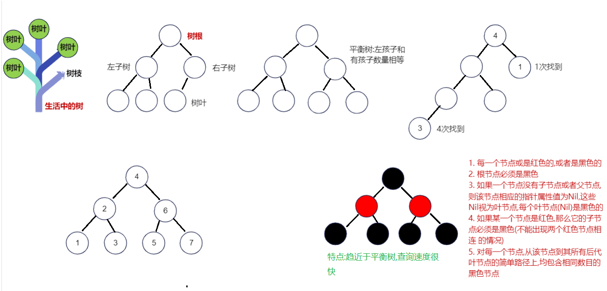

```java
1. 每一个节点或是红色的,或者是黑色的

2. 根节点必须是黑色

3. 如果一个节点没有子节点或者父节点,则该节点相应的指针属性值为Nil,这些Nil视为叶节点,每个叶节点(Nil)是黑色的

4. 如果某一个节点是红色,那么它的子节点必须是黑色(不能出现两个红色节点相连 的情况)

5. 对每一个节点,从该节点到其所有后代叶节点的简单路径上,均包含相同数目的黑色节点
```

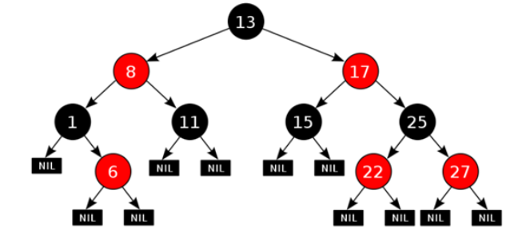

红黑树结构插入数据在线演示： https://www.cs.usfca.edu/~galles/visualization/RedBlack

# Set集合

```java
1.涛哥总说:Set接口并没有对Collection接口进行功能上的扩充,而且所有的Set集合底层都是依靠Map实现
```

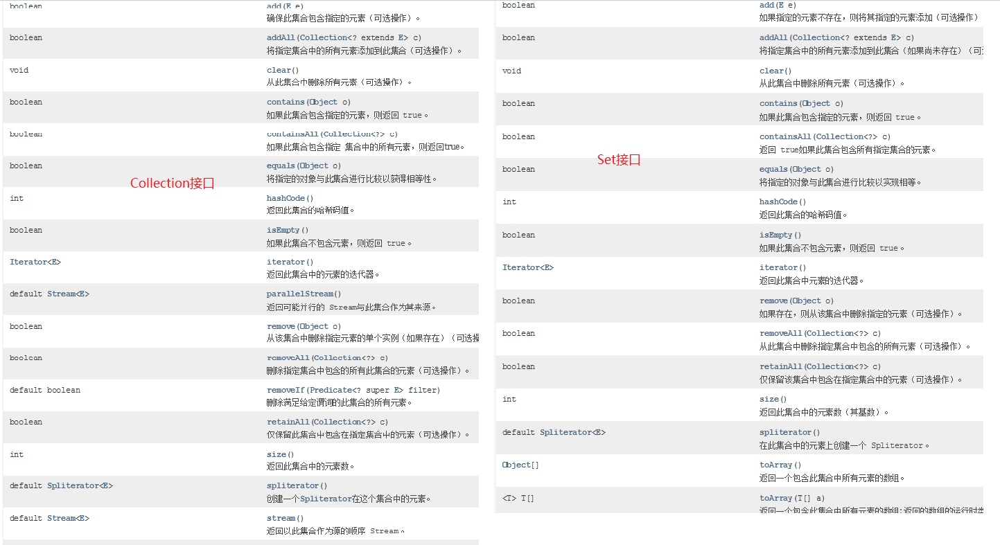

## Set集合介绍

```java
Set和Map密切相关的
Map的遍历需要先变成单列集合,只能变成set集合
```

## HashSet集合的介绍和使用

```java
1.概述:HashSet是Set接口的实现类
2.特点:
  a.元素唯一
  b.元素无序
  c.无索引
  d.线程不安全
3.数据结构:哈希表
  a.jdk8之前:哈希表 = 数组+链表
  b.jdk8之后:哈希表 = 数组+链表+红黑树
            加入红黑树目的:查询快
4.方法:和Collection一样
5.遍历:
  a.增强for
  b.迭代器
```

```java
public class Demo01HashSet {
    public static void main(String[] args) {
        HashSet<String> set = new HashSet<>();
        set.add("张三");
        set.add("李四");
        set.add("王五");
        set.add("赵六");
        set.add("田七");
        set.add("张三");
        System.out.println(set);

        //迭代器
        Iterator<String> iterator = set.iterator();
        while(iterator.hasNext()){
            System.out.println(iterator.next());
        }

        System.out.println("============");

        //增强for
        for (String s : set) {
            System.out.println(s);
        }
    }
}

```

## LinkedHashSet的介绍以及使用

```java
1.概述:LinkedHashSet extends HashSet
2.特点:
  a.元素唯一
  b.元素有序
  c.无索引
  d.线程不安全
3.数据结构:
  哈希表+双向链表
4.使用:和HashSet一样      
```

```java
public class Demo02LinkedHashSet {
    public static void main(String[] args) {
        LinkedHashSet<String> set = new LinkedHashSet<>();
        set.add("张三");
        set.add("李四");
        set.add("王五");
        set.add("赵六");
        set.add("田七");
        set.add("张三");
        System.out.println(set);

        //迭代器
        Iterator<String> iterator = set.iterator();
        while(iterator.hasNext()){
            System.out.println(iterator.next());
        }

        System.out.println("============");

        //增强for
        for (String s : set) {
            System.out.println(s);
        }
    }
}
```

## 哈希值

```java
1.概述:是由计算机算出来的一个十进制数,可以看做是对象的地址值
2.获取对象的哈希值,使用的是Object中的方法
  public native int hashCode()
    
3.注意:如果重写了hashCode方法,那计算的就是对象内容的哈希值了
    
4.总结:
  a.哈希值不一样,内容肯定不一样
  b.哈希值一样,内容也有可能不一样    
```

```java
public class Person {
    private String name;
    private Integer age;

    public Person() {
    }

    public Person(String name, Integer age) {
        this.name = name;
        this.age = age;
    }

    public String getName() {
        return name;
    }

    public void setName(String name) {
        this.name = name;
    }

    public Integer getAge() {
        return age;
    }

    public void setAge(Integer age) {
        this.age = age;
    }

    @Override
    public boolean equals(Object o) {
        if (this == o) return true;
        if (o == null || getClass() != o.getClass()) return false;
        Person person = (Person) o;
        return Objects.equals(name, person.name) && Objects.equals(age, person.age);
    }

    @Override
    public int hashCode() {
        return Objects.hash(name, age);
    }
}

```

```java
public class Demo01Hash {
    public static void main(String[] args) {
        Person p1 = new Person("涛哥", 18);
        Person p2 = new Person("涛哥", 18);
        System.out.println(p1);//com.atguigu.f_hash.Person@4eec7777
        System.out.println(p2);//com.atguigu.f_hash.Person@3b07d329

        System.out.println(p1.hashCode());
        System.out.println(p2.hashCode());

        //System.out.println(Integer.toHexString(1324119927));//4eec7777
        //System.out.println(Integer.toHexString(990368553));//3b07d329

        System.out.println("======================");

        String s1 = "abc";
        String s2 = new String("abc");
        System.out.println(s1.hashCode());//96354
        System.out.println(s2.hashCode());//96354

        System.out.println("=========================");

        String s3 = "通话";
        String s4 = "重地";
        System.out.println(s3.hashCode());//1179395
        System.out.println(s4.hashCode());//1179395

    }
}

```

> ```java
> 如果不重写hashCode方法,默认计算对象的哈希值
> 如果重写了hashCode方法,计算的是对象内容的哈希值
> ```

## 字符串的哈希值时如何算出来的

```java
String s = "abc"
byte[] value = {97,98,99}    
```

```java
public int hashCode() {
    int h = hash;
    if (h == 0 && !hashIsZero) {
        h = isLatin1() ? StringLatin1.hashCode(value)
                       : StringUTF16.hashCode(value);
        if (h == 0) {
            hashIsZero = true;
        } else {
            hash = h;
        }
    }
    return h;
}
====================================================
StringLatin1.hashCode(value)底层源码,String中的哈希算法
    
public static int hashCode(byte[] value) {
    int h = 0;
    for (byte v : value) {
        h = 31 * h + (v & 0xff);
    }
    return h;
}
```

```java
直接跑到StringLatin1.hashCode(value)底层源码,计算abc的哈希值-> 0xff这个十六进制对应的十进制255
任何数据和255做&运算,都是原值
    
第一圈:
  h = 31*0+97 = 97
第二圈:
  h = 31*97+98 = 3105
第三圈:
  h = 31*3105+99 = 96354
```

```java
问题:在计算哈希值的时候,有一个定值就是31,为啥?
     31是一个质数,31这个数通过大量的计算,统计,认为用31,可以尽量降低内容不一样但是哈希值一样的情况
    
     内容不一样,哈希值一样(哈希冲突,哈希碰撞)
```

## HashSet的存储去重复的过程

```java
1.先计算元素的哈希值(重写hashCode方法),再比较内容(重写equals方法)
2.先比较哈希值,如果哈希值不一样,存
3.如果哈希值一样,再比较内容
  a.如果哈希值一样,内容不一样,存
  b.如果哈希值一样,内容也一样,去重复  
```

```java
public class Test02 {
    public static void main(String[] args) {
        HashSet<String> set = new HashSet<>();
        set.add("abc");
        set.add("通话");
        set.add("重地");
        set.add("abc");
        System.out.println(set);//[通话, 重地, abc]

    }
}
```

## HashSet存储自定义类型如何去重复

```java
public class Person {
    private String name;
    private Integer age;

    public Person() {
    }

    public Person(String name, Integer age) {
        this.name = name;
        this.age = age;
    }

    public String getName() {
        return name;
    }

    public void setName(String name) {
        this.name = name;
    }

    public Integer getAge() {
        return age;
    }

    public void setAge(Integer age) {
        this.age = age;
    }

    @Override
    public boolean equals(Object o) {
        if (this == o) return true;
        if (o == null || getClass() != o.getClass()) return false;
        Person person = (Person) o;
        return Objects.equals(name, person.name) && Objects.equals(age, person.age);
    }

    @Override
    public int hashCode() {
        return Objects.hash(name, age);
    }

    @Override
    public String toString() {
        return "Person{" +
                "name='" + name + '\'' +
                ", age=" + age +
                '}';
    }
}
```

```java
public class Test03 {
    public static void main(String[] args) {
        HashSet<Person> set = new HashSet<>();
        set.add(new Person("涛哥",16));
        set.add(new Person("金莲",24));
        set.add(new Person("涛哥",16));
        System.out.println(set);
    }
}
```

```java
总结:
1.如果HashSet存储自定义类型,如何去重复呢?重写hashCode和equals方法,让HashSet比较属性的哈希值以及属性的内容
2.如果不重写hashCode和equals方法,默认调用的是Object中的,不同的对象,肯定哈希值不一样,equals比较对象的地址值也不一样,所以此时即使对象的属性值一样,也不能去重复    
```

# 模块十九总结及模块二十重点

```
模块19回顾:
  1.Collections集合工具类
    方法:
        addAll-> 批量添加元素
        shuffle-> 元素打乱
        sort->排序-> ascii
        sort(集合,比较器)-> 按照指定的顺序排序
  2.泛型:
    a.含有泛型的类:
      public class 类名<E>{}
      new对象的时候确定类型
    b.含有泛型的方法:
      修饰符 <E> 返回值类型 方法名(E e){}
      调用的时候确定类型
    c.含有泛型的接口
      public interface 接口名<E>{}
      在实现类的时候确定类型
      在实现类的时候还没有确定类型,只能new对象的时候确定
    d.泛型通配符
      <? extends 类型> ?接收的泛型类型是后面类的本类以及子类
      <? super 类型> ?接收的泛型类型是后面类的本类以及父类
          
  3.哈希值:计算机计算出来的十进制数,可以看成是对象的地址值
    a.要是没有重写hashCode方法,默认调用Object中的hashCode方法,计算的是对象的哈希值
    b.要是重写了hashCode方法,计算的是对象内容的哈希值
  4.HashSet集合
    特点:  元素唯一  无序 无索引 线程不安全
    数据结构: 哈希表 = 数组+链表+红黑树
   
  5.LinkedHashSet
    特点:元素唯一  有序 无索引 线程不安全  
    数据结构: 哈希表+双向链表
  6.set存储自定义对象怎么去重复 -> 重写hashCode和equals方法
        
  7.去重复过程:先比较元素哈希值,再比较内容
    如果哈希值不一样,存
    如果哈希值一样,再比较内容->哈希值一样,内容不一样,存;哈希值一样,内容一样,去重复
        
模块20重点:
  1.会使用HashMap和LinkedHashMap以及知道他们的特点
  2.会使用Properties属性集
  3.会操作集合嵌套
  4.知道哈希表结构存储元素过程    
```

# Map集合 

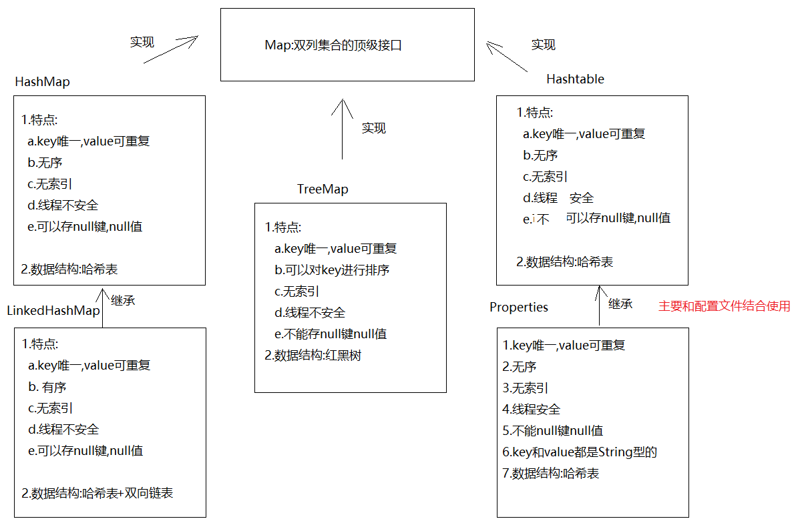																	

## Map的介绍

```java
1.概述:是双列集合的顶级接口
2.元素特点:
  元素都是由key(键),value(值)组成 -> 键值对
```

## HashMap的介绍和使用

```java
1.概述:HashMap是Map的实现类
2.特点:
  a.key唯一,value可重复 -> 如果key重复了,会发生value覆盖
  b.无序
  c.无索引
  d.线程不安全
  e.可以存null键null值
3.数据结构:
  哈希表
4.方法:
  V put(K key, V value)  -> 添加元素,返回的是
  V remove(Object key)  ->根据key删除键值对,返回的是被删除的value
  V get(Object key) -> 根据key获取value
  boolean containsKey(Object key)  -> 判断集合中是否包含指定的key
  Collection<V> values() -> 获取集合中所有的value,转存到Collection集合中
      
  Set<K> keySet()->将Map中的key获取出来,转存到Set集合中  
  Set<Map.Entry<K,V>> entrySet()->获取Map集合中的键值对,转存到Set集合中
```

```java
public class Demo01HashMap {
    public static void main(String[] args) {
        HashMap<String, String> map = new HashMap<>();
        //V put(K key, V value)  -> 添加元素,返回的是被覆盖的value
        String value1 = map.put("猪八", "嫦娥");
        System.out.println(value1);
        String value2 = map.put("猪八", "高翠兰");
        System.out.println(value2);
        System.out.println(map);

        map.put("后裔","嫦娥");
        map.put("二郎神","嫦娥");
        map.put("唐僧","女儿国国王");
        map.put("涛哥","金莲");
        map.put(null,null);
        System.out.println(map);

        //V remove(Object key)  ->根据key删除键值对,返回的是被删除的value
        String value3 = map.remove("涛哥");
        System.out.println(value3);
        System.out.println(map);
        //V get(Object key) -> 根据key获取value
        System.out.println(map.get("唐僧"));
        //boolean containsKey(Object key)  -> 判断集合中是否包含指定的key
        System.out.println(map.containsKey("二郎神"));
        //Collection<V> values() -> 获取集合中所有的value,转存到Collection集合中
        Collection<String> collection = map.values();
        System.out.println(collection);
    }
}
```

```java
1.概述:LinkedHashMap extends HashMap
2.特点:
  a.key唯一,value可重复 -> 如果key重复了,会发生value覆盖
  b.有序
  c.无索引
  d.线程不安全
  e.可以存null键null值
3.数据结构:
  哈希表+双向链表
4.使用:和HashMap一样      
```

```java
public class Demo02LinkedHashMap {
    public static void main(String[] args) {
        LinkedHashMap<String, String> map = new LinkedHashMap<>();
        map.put("八戒","嫦娥");
        map.put("涛哥","金莲");
        map.put("涛哥","三上");
        map.put("唐僧","女儿国国王");
        System.out.println(map);
    }
}
```

## HashMap的两种遍历方式

### 方式一: 获取key,根据key再获取value

```java
Set<K> keySet()->将Map中的key获取出来,转存到Set集合中  
```

```java
public class Demo03HashMap {
    public static void main(String[] args) {
        HashMap<String, String> map = new HashMap<>();
        map.put("猪八", "嫦娥");
        map.put("猪八", "高翠兰");
        map.put("后裔","嫦娥");
        map.put("二郎神","嫦娥");
        map.put("唐僧","女儿国国王");
        map.put("涛哥","金莲");

        Set<String> set = map.keySet();//获取所有的key,保存到set集合中
        for (String key : set) {
            //根据key获取value
            System.out.println(key+".."+map.get(key));
        }

    }
}
```

### 方式二: 同时获取key和value

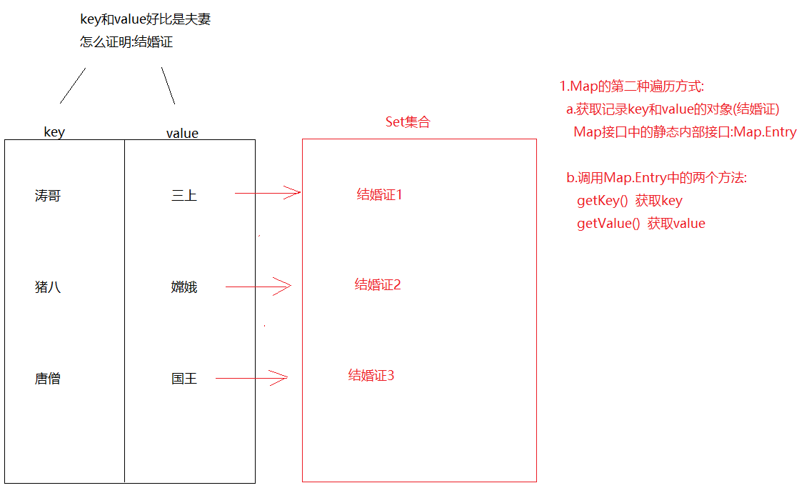

```java
Set<Map.Entry<K,V>> entrySet()->获取Map集合中的键值对,转存到Set集合中
```

```java
public class Demo04HashMap {
    public static void main(String[] args) {
        HashMap<String, String> map = new HashMap<>();
        map.put("猪八", "嫦娥");
        map.put("猪八", "高翠兰");
        map.put("后裔","嫦娥");
        map.put("二郎神","嫦娥");
        map.put("唐僧","女儿国国王");
        map.put("涛哥","金莲");

        /*
          Set集合中保存的都是"结婚证"-> Map.Entry
          我们需要将"结婚证"从set集合中遍历出来
         */
        Set<Map.Entry<String, String>> set = map.entrySet();
        for (Map.Entry<String, String> entry : set) {
            String key = entry.getKey();
            String value = entry.getValue();
            System.out.println(key+"..."+value);
        }
    }
}
```

## Map存储自定义对象时如何去重复

```java
public class Person {
    private String name;
    private Integer age;

    public Person() {
    }

    public Person(String name, Integer age) {
        this.name = name;
        this.age = age;
    }

    public String getName() {
        return name;
    }

    public void setName(String name) {
        this.name = name;
    }

    public Integer getAge() {
        return age;
    }

    public void setAge(Integer age) {
        this.age = age;
    }

    @Override
    public String toString() {
        return "Person{" +
                "name='" + name + '\'' +
                ", age=" + age +
                '}';
    }

    @Override
    public boolean equals(Object o) {
        if (this == o) return true;
        if (o == null || getClass() != o.getClass()) return false;
        Person person = (Person) o;
        return Objects.equals(name, person.name) && Objects.equals(age, person.age);
    }

    @Override
    public int hashCode() {
        return Objects.hash(name, age);
    }
}
```

```java
public class Demo05HashMap {
    public static void main(String[] args) {
        HashMap<Person, String> map = new HashMap<>();
        map.put(new Person("涛哥",18),"河北省");
        map.put(new Person("三上",26),"日本");
        map.put(new Person("涛哥",18),"北京市");
        System.out.println(map);
    }
}
```

```java
如果key为自定义类型,去重复的话,重写hashCode和equals方法,去重复过程和set一样一样的
因为set集合的元素到了底层都是保存到了map的key位置上
```

## Map的练习

```java
需求:用Map集合统计字符串中每一个字符出现的次数
步骤:
  1.创建Scanner和HashMap
  2.遍历字符串,将每一个字符获取出来
  3.判断,map中是否包含遍历出来的字符 -> containsKey
  4.如果不包含,证明此字符第一次出现,直接将此字符和1存储到map中
  5.如果包含,根据字符获取对应的value,让value++
  6.将此字符和改变后的value重新保存到map集合中
  7.输出
```

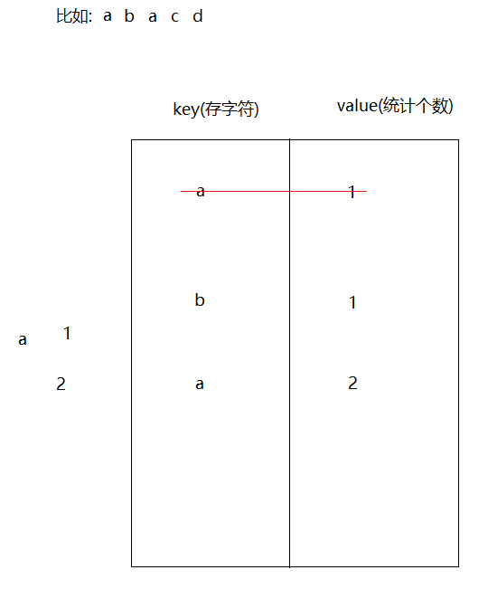

```java
public class Demo06HashMap {
    public static void main(String[] args) {
        //1.创建Scanner和HashMap
        Scanner sc = new Scanner(System.in);
        HashMap<String, Integer> map = new HashMap<>();
        String data = sc.next();
        //2.遍历字符串,将每一个字符获取出来
        char[] chars = data.toCharArray();
        for (char aChar : chars) {
            String key = aChar+"";
            //3.判断,map中是否包含遍历出来的字符 -> containsKey
            if (!map.containsKey(key)){
            //4.如果不包含,证明此字符第一次出现,直接将此字符和1存储到map中
                map.put(key,1);
            }else{
                //5.如果包含,根据字符获取对应的value,让value++
                //6.将此字符和改变后的value重新保存到map集合中
                Integer value = map.get(key);
                value++;
                map.put(key,value);
            }
        }

        //7.输出
        System.out.println(map);
    }
}
```

## 斗地主Map版本

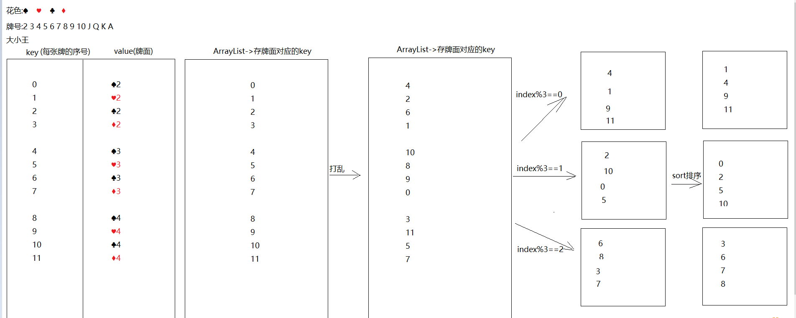

```java
public class Demo07Poker {
    public static void main(String[] args) {
        //1.创建数组-> color -> 专门存花色
        String[] color = "♠-♥-♣-♦".split("-");
        //2.创建数组 -> number -> 专门存牌号
        String[] number = "2-3-4-5-6-7-8-9-10-J-Q-K-A".split("-");
        //3.创建map集合,key为序号,value为组合好的牌面
        HashMap<Integer, String> poker = new HashMap<>();
        //4.创建一个ArrayList,专门存储key
        ArrayList<Integer> list = new ArrayList<>();
        list.add(0);
        list.add(1);

        //5.组合牌,存储到map中
        int key = 2;
        for (String num : number) {
            for (String huaSe : color) {
                String pokerNumber = huaSe+num;
                poker.put(key,pokerNumber);
                list.add(key);
                key++;
            }
        }

        poker.put(0,"😊");
        poker.put(1,"☺");

        //6.洗牌,打乱list集合中的key
        Collections.shuffle(list);
        //7.创建四个list集合
        ArrayList<Integer> p1 = new ArrayList<>();
        ArrayList<Integer> p2 = new ArrayList<>();
        ArrayList<Integer> p3 = new ArrayList<>();
        ArrayList<Integer> dipai = new ArrayList<>();

        //8.发牌
        for (int i = 0; i < list.size(); i++) {
            Integer key1 = list.get(i);
            if (i>=51){
                dipai.add(key1);
            }else if (i%3==0){
                p1.add(key1);
            }else if (i%3==1){
                p2.add(key1);
            }else if (i%3==2){
                p3.add(key1);
            }
        }

        //9.排序
        Collections.sort(p1);
        Collections.sort(p2);
        Collections.sort(p3);
        Collections.sort(dipai);

        lookPoker("涛哥",p1,poker);
        lookPoker("三上",p2,poker);
        lookPoker("金莲",p3,poker);
        lookPoker("大郎",dipai,poker);
    }

    private static void lookPoker(String name, ArrayList<Integer> list, HashMap<Integer, String> map) {
        System.out.print(name+":");

        for (Integer key : list) {
            String value = map.get(key);
            System.out.print(value+" ");
        }

        System.out.println();
    }
}

```

# 哈希表结构存储过程

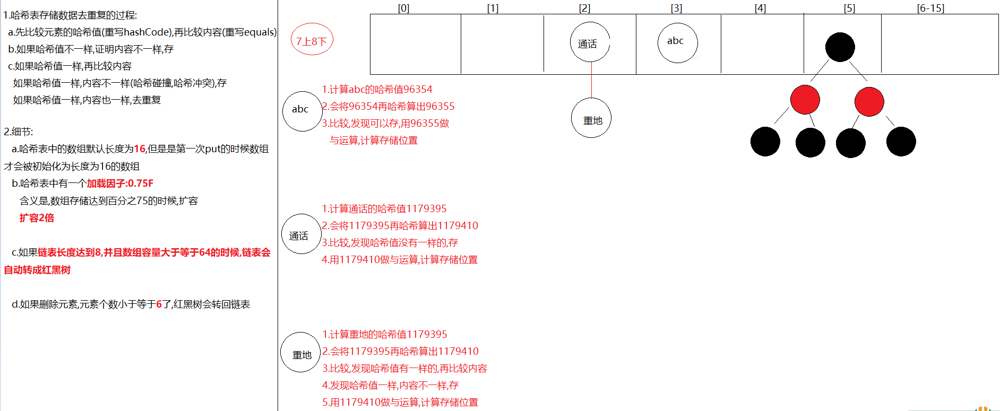

```java
1.HashMap底层数据数据结构:哈希表
2.jdk7:哈希表 = 数组+链表
  jdk8:哈希表 = 数组+链表+红黑树
3.
  先算哈希值,此哈希值在HashMap底层经过了特殊的计算得出
  如果哈希值不一样,直接存
  如果哈希值一样,再去比较内容,如果内容不一样,也存
  如果哈希值一样,内容也一样,直接去重复(后面的value将前面的value覆盖)
  
  哈希值一样,内容不一样->哈希冲突(哈希碰撞)
4.要知道的点:
  a.在不指定长度时,哈希表中的数组默认长度为16,HashMap创建出来,一开始没有创建长度为16的数组
  b.什么时候创建的长度为16的数组呢?在第一次put的时候,底层会创建长度为16的数组
  c.哈希表中有一个数据加[加载因子]->默认为0.75(加载因子)->代表当元素存储到百分之75的时候要扩容了->2倍
  d.如果对个元素出现了哈希值一样,内容不一样时,就会在同一个索引上以链表的形式存储,当链表长度达到8并且当前数组长度>=64时,链表就会改成使用红黑树存储
    如果后续删除元素,那么在同一个索引位置上的元素个数小于6,红黑树会变回链表
  e.加入红黑树目的:查询快
```

```java
外面笔试时可能会问到的变量
default_initial_capacity:HashMap默认容量  16
default_load_factor:HashMap默认加载因子   0.75f
threshold:扩容的临界值   等于   容量*0.75 = 12  第一次扩容
treeify_threshold:链表长度默认值,转为红黑树:8
min_treeify_capacity:链表被树化时最小的数组容量:64
```

> 1.问题: 哈希表中有数组的存在,但是为啥说没有索引呢?
>
> ​            哈希表中虽然有数组,但是set和map却没有索引,因为存数据的时候有可能在同一个索引下形成链表,如果2索引上有一条链表,那么我们要是按照索引2获取,咱们获取哪个元素呢?所以就取消了按照索引操作的机制
>
> 2.问题:为啥说HashMap是无序的,LinkedHashMap是有序的呢?
>
> ​    原因:HashMap底层哈希表为单向链表
>
> ​             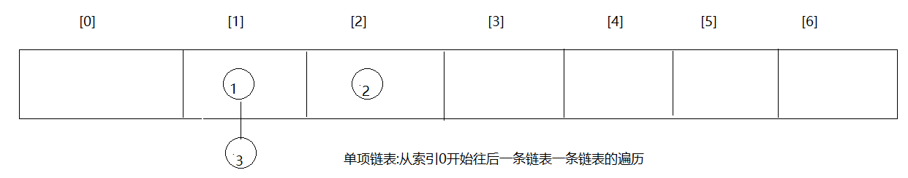
>
> ​             LinkedHashMap底层在哈希表的基础上加了一条双向链表    
>
> 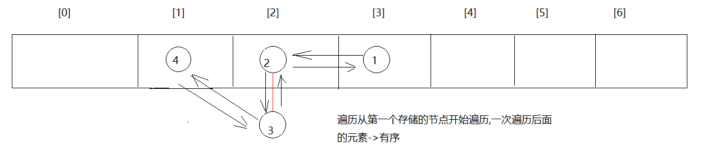

## HashMap无参数构造方法的分析

```java
//HashMap中的静态成员变量
static final float DEFAULT_LOAD_FACTOR = 0.75f;
public HashMap() {
    this.loadFactor = DEFAULT_LOAD_FACTOR; // all other fields defaulted
}
```

解析：使用无参数构造方法创建HashMap对象，将加载因子设置为默认的加载因子，loadFactor=0.75F。

## HashMap有参数构造方法分析

```java
HashMap(int initialCapacity, float loadFactor) ->创建Map集合的时候指定底层数组长度以及加载因子
    
public HashMap(int initialCapacity, float loadFactor) {
    if (initialCapacity < 0)
    	throw new IllegalArgumentException("Illegal initial capacity: " +
    initialCapacity);
    if (initialCapacity > MAXIMUM_CAPACITY)
    	initialCapacity = MAXIMUM_CAPACITY;
    if (loadFactor <= 0 || Float.isNaN(loadFactor))
    	throw new IllegalArgumentException("Illegal load factor: " +
    loadFactor);
    this.loadFactor = loadFactor;
    this.threshold = tableSizeFor(initialCapacity);//10
}
```

解析：带有参数构造方法，传递哈希表的初始化容量和加载因子

如果`initialCapacity`（初始化容量）小于0，直接抛出异常。

如果`initialCapacity`大于最大容器，initialCapacity直接等于最大容器
- `MAXIMUM_CAPACITY` = 1 << 30 是最大容量  (1073741824)

如果`loadFactor`（加载因子）小于等于0，直接抛出异常

`tableSizeFor`（initialCapacity）方法计算哈希表的初始化容量。

- 注意：哈希表是进行计算得出的容量，而初始化容量不直接等于我们传递的参数。

## tableSizeFor方法分析

```java
static final int tableSizeFor(int cap) {
    int n = cap - 1;
    n |= n >>> 1;
    n |= n >>> 2;
    n |= n >>> 4;
    n |= n >>> 8;
    n |= n >>> 16;
    return (n < 0) ? 1 : (n >= MAXIMUM_CAPACITY) ? MAXIMUM_CAPACITY : n + 1;
}

8  4  2  1规则->无论指定了多少容量,最终经过tableSizeFor这个方法计算之后,都会遵循8421规则去初始化列表容量为了存取高效，尽量较少碰撞
```

解析：该方法对我们传递的初始化容量进行位移运算，位移的结果是 8 4 2 1 码

- 例如传递2，结果还是2，传递的是4，结果还是4。
- 例如传递3，结果是4，传递5，结果是8，传递20，结果是32。

## Node 内部类分析

哈希表是采用数组+链表的实现方法，HashMap中的内部类Node非常重要，证明HashSet是一个单向链表

```java
 static class Node<K,V> implements Map.Entry<K,V> {
     final int hash;
     final K key;
     V value;
     Node<K,V> next;
 Node(int hash, K key, V value, Node<K,V> next) {
     this.hash = hash;
     this.key = key;
     this.value = value;
     this.next = next;
}
```

解析：内部类Node中具有4个成员变量

- hash，对象的哈希值
- key，作为键的对象
- value，作为值得对象（讲解Set集合，不牵扯值得问题）
- next，下一个节点对象

## 存储元素的put方法源码

```java
public V put(K key, V value) {
	return putVal(hash(key), key, value, false, true);
}
```

解析：put方法中调研putVal方法，putVal方法中调用hash方法。

- hash(key)方法：传递要存储的元素，获取对象的哈希值
- putVal方法，传递对象哈希值和要存储的对象key

## putVal方法源码

```java
Node<K,V>[] tab; Node<K,V> p; int n, i;
	if ((tab = table) == null || (n = tab.length) == 0)
		n = (tab = resize()).length;
```

解析：方法中进行Node对象数组的判断，如果数组是null或者长度等于0，那么就会调研resize()方法进行数组的扩容。

## resize方法的扩容计算

```java
if (oldCap > 0) {
     if (oldCap >= MAXIMUM_CAPACITY) {
         threshold = Integer.MAX_VALUE;
         return oldTab;
     }
     else if ((newCap = oldCap << 1) < MAXIMUM_CAPACITY &&
              oldCap >= DEFAULT_INITIAL_CAPACITY)
         newThr = oldThr << 1; // double threshold
}
```

解析：计算结果，新的数组容量=原始数组容量<<1，也就是乘以2。

## 确定元素存储的索引

```java
if ((p = tab[i = (n - 1) & hash]) == null)
	 tab[i] = newNode(hash, key, value, null);
```

解析：i = (数组长度 - 1) & 对象的哈希值，会得到一个索引，然后在此索引下tab[i]，创建链表对象。

不同哈希值的对象，也是有可能存储在同一个数组索引下。

```java
其中resize()扩容的方法,默认是16
 tab[i] = newNode(hash, key, value, null);->将元素放在数组中  i就是索引

 i = (n - 1) & hash
     0000 0000 0000 0000 0000 0000 0000 1111->15
                                                    &   0&0=0 0&1=0 1&1=1
     0000 0000 0000 0001 0111 1000 0110 0011->96355
--------------------------------------------------------
     0000 0000 0000 0000 0000 0000 0000 0011->3
```

```java
     0000 0000 0000 0000 0000 0000 0000 1111->15
                                                    &   0&0=0 0&1=0 1&1=1
     0000 0000 0001 0001 1111 1111 0001 0010->1179410
--------------------------------------------------------
     0000 0000 0000 0000 0000 0000 0000 0010->2
```

## 遇到重复哈希值的对象

```java
 Node<K,V> e; K k;
 if (p.hash == hash &&
 	((k = p.key) == key || (key != null && key.equals(k))))
		 e = p;
```

解析：如果对象的哈希值相同，对象的equals方法返回true，判断为一个对象，进行覆盖操作。

```java
else {
     for (int binCount = 0; ; ++binCount) {
     	if ((e = p.next) == null) {
     		p.next = newNode(hash, key, value, null);
     	if (binCount >= TREEIFY_THRESHOLD - 1) // -1 for 1st
     		treeifyBin(tab, hash);
     	break;
 }
```

解析：如果对象哈希值相同，但是对象的equals方法返回false，将对此链表进行遍历，当链表没有下一个节点的时候，创建下一个节点存储对象.

# TreeSet

```java
1.概述:TreeSet是Set的实现类
2.特点:
  a.对元素进行排序
  b.无索引
  c.不能存null
  d.线程不安全
  e.元素唯一
3.数据结构:红黑树      
```

```java
构造:
  TreeSet() -> 构造一个新的空 set，该 set 根据其元素的自然顺序进行排序 -> ASCII 
  TreeSet(Comparator<? super E> comparator)构造一个新的空 TreeSet，它根据指定比较器进行排序     
```

```java
public class Person {
    private String name;
    private Integer age;

    public Person() {
    }

    public Person(String name, Integer age) {
        this.name = name;
        this.age = age;
    }

    public String getName() {
        return name;
    }

    public void setName(String name) {
        this.name = name;
    }

    public Integer getAge() {
        return age;
    }

    public void setAge(Integer age) {
        this.age = age;
    }

    @Override
    public String toString() {
        return "Person{" +
                "name='" + name + '\'' +
                ", age=" + age +
                '}';
    }

    @Override
    public boolean equals(Object o) {
        if (this == o) return true;
        if (o == null || getClass() != o.getClass()) return false;
        Person person = (Person) o;
        return Objects.equals(name, person.name) && Objects.equals(age, person.age);
    }

    @Override
    public int hashCode() {
        return Objects.hash(name, age);
    }
}
```

```java
public class Demo01TreeSet {
    public static void main(String[] args) {
        TreeSet<String> set1 = new TreeSet<>();
        set1.add("c.白毛浮绿水");
        set1.add("a.鹅鹅鹅");
        set1.add("b.曲项向天歌");
        set1.add("d.红掌拨清波");
        System.out.println(set1);

        System.out.println("=====================");
        TreeSet<Person> set2 = new TreeSet<>(new Comparator<Person>() {
            @Override
            public int compare(Person o1, Person o2) {
                return o1.getAge()-o2.getAge();
            }
        });
        set2.add(new Person("柳岩",18));
        set2.add(new Person("涛哥",12));
        set2.add(new Person("三上",20));
        System.out.println(set2);
    }
}
```

# TreeMap

```java
1.概述:TreeMap是Map的实现类
2.特点:
  a.对key进行排序
  b.无索引
  c.key唯一
  d.线程不安全
  e.不能存null
3.数据结构:红黑树      
```

```java
构造:
  TreeMap() -> 使用键的自然顺序构造一个新的、空的树映射 -> ASCII 
  TreeMap(Comparator<? super E> comparator)构造一个新的、空的树映射，该映射根据给定比较器进行排序
```

```java
public class Person {
    private String name;
    private Integer age;

    public Person() {
    }

    public Person(String name, Integer age) {
        this.name = name;
        this.age = age;
    }

    public String getName() {
        return name;
    }

    public void setName(String name) {
        this.name = name;
    }

    public Integer getAge() {
        return age;
    }

    public void setAge(Integer age) {
        this.age = age;
    }

    @Override
    public String toString() {
        return "Person{" +
                "name='" + name + '\'' +
                ", age=" + age +
                '}';
    }

    @Override
    public boolean equals(Object o) {
        if (this == o) return true;
        if (o == null || getClass() != o.getClass()) return false;
        Person person = (Person) o;
        return Objects.equals(name, person.name) && Objects.equals(age, person.age);
    }

    @Override
    public int hashCode() {
        return Objects.hash(name, age);
    }
}

```

```java
public class Demo02TreeMap {
    public static void main(String[] args) {
        TreeMap<String, String> map1 = new TreeMap<>();
        map1.put("c","白毛浮绿水");
        map1.put("a","鹅鹅鹅");
        map1.put("b","曲项向天歌");
        map1.put("d","红掌拨清波");
        System.out.println(map1);

        System.out.println("=============");

        TreeMap<Person, String> map2 = new TreeMap<>(new Comparator<Person>() {
            @Override
            public int compare(Person o1, Person o2) {
                return o1.getAge()-o2.getAge();
            }
        });

        map2.put(new Person("柳岩",18),"北京");
        map2.put(new Person("涛哥",12),"北京");
        map2.put(new Person("三上",20),"北京");
        System.out.println(map2);

    }
}
```

# Hashtable和Vector集合(了解)

## Hashtable集合

```java
1.概述:Hashtable是Map的实现类
2.特点:
  a.key唯一,value可重复
  b.无序
  c.无索引
  d.线程安全   
  e.不能存储null键,null值
3.数据结构:哈希表      
```

```java
public class Demo01Hashtable {
    public static void main(String[] args) {
        Hashtable<String, String> table = new Hashtable<>();
        table.put("迪丽热巴","马尔扎哈");
        table.put("古力娜扎","涛哥思密达");
        table.put("古力娜扎","雷霆嘎巴");
        table.put("玛卡巴卡","哈哈哈哈");
        //table.put(null,null);
        System.out.println(table);
    }
}
```

> HashMap和Hashtable区别:
>
>   相同点:元素无序,无索引,key唯一
>
>   不同点:HashMap线程不安全,Hashtable线程安全
>
> ​               HashMap可以存储null键null值;Hashtable不能

## Vector集合

```java
1.概述:Vector是List接口的实现类
2.特点:
  a.元素有序
  b.有索引
  c.元素可重复
  d.线程安全
3.数据结构:数组
    
4.源码分析:
  a.如果用空参构造创建对象,数组初始容量为10,如果超出范围,自动扩容,2倍
  b.如果用有参构造创建对象,如果超出了范围,自动扩容,扩的是老数组长度+指定的容量增强
```

```java
public class Demo02Vector {
    public static void main(String[] args) {
        Vector<String> vector = new Vector<>();
        vector.add("张三");
        vector.add("李四");
        for (String s : vector) {
            System.out.println(s);
        }
    }
}
```

> Vector底层源码分析
>
> ```java
> Vector() 构造一个空向量，使其内部数据数组的大小为 10，其标准容量增量为零
> Vector(int initialCapacity, int capacityIncrement)使用指定的初始容量和容量增量构造一个空的向量 
> ```
>
> ```java
> Vector<String> vector = new Vector<>();
> public Vector() {
>     this(10);
> }
> public Vector(int initialCapacity->10) {
>     this(initialCapacity, 0);
> }
> public Vector(int initialCapacity->10, int capacityIncrement->0) {
>     super();
>     if (initialCapacity < 0)
>         throw new IllegalArgumentException("Illegal Capacity: "+
>                                            initialCapacity);
>     this.elementData = new Object[initialCapacity];//长度为0的数组
>     this.capacityIncrement = capacityIncrement;//0
> }
> =====================================================
> vector.add("李四");-> 假设李四是第11个元素
> public synchronized boolean add(E e) {
>     modCount++;
>     ensureCapacityHelper(elementCount + 1);
>     elementData[elementCount++] = e;
>     return true;
> }  
> private void ensureCapacityHelper(int minCapacity->11) {
>     // overflow-conscious code
>     if (minCapacity - elementData.length > 0)
>         grow(minCapacity->11);
> }
> private void grow(int minCapacity->11) {
>     // overflow-conscious code
>     int oldCapacity = elementData.length;//10
>     int newCapacity = oldCapacity + ((capacityIncrement > 0) ?
>                                      capacityIncrement : oldCapacity);//10+10=20
>     if (newCapacity - minCapacity < 0)
>         newCapacity = minCapacity;
>     if (newCapacity - MAX_ARRAY_SIZE > 0)
>         newCapacity = hugeCapacity(minCapacity);
>     elementData = Arrays.copyOf(elementData, newCapacity);
> }
> ```
>
> ```java
> Vector<String> vector = new Vector<>(10,5);
> public Vector(int initialCapacity->10, int capacityIncrement->5) {
>     super();
>     if (initialCapacity < 0)
>         throw new IllegalArgumentException("Illegal Capacity: "+
>                                            initialCapacity);
>     this.elementData = new Object[initialCapacity];
>     this.capacityIncrement = capacityIncrement;//5
> }
> 
> ======================================================
> vector.add("李四");-> 假设李四是第11个元素
> public synchronized boolean add(E e) {
>     modCount++;
>     ensureCapacityHelper(elementCount + 1);
>     elementData[elementCount++] = e;
>     return true;
> }    
> 
> private void ensureCapacityHelper(int minCapacity->11) {
>     // overflow-conscious code
>     if (minCapacity - elementData.length > 0)
>         grow(minCapacity);
> }
> 
> private void grow(int minCapacity->11) {
>     // overflow-conscious code
>     int oldCapacity = elementData.length;//10
>     int newCapacity = oldCapacity + ((capacityIncrement > 0) ?
>                                      capacityIncrement : oldCapacity);
>     if (newCapacity - minCapacity < 0)
>         newCapacity = minCapacity;
>     if (newCapacity - MAX_ARRAY_SIZE > 0)
>         newCapacity = hugeCapacity(minCapacity);
>     elementData = Arrays.copyOf(elementData, newCapacity);
> }
> ```

# Properties集合(属性集)

```java
1.概述:Properties 继承自 Hashtable
2.特点:
  a.key唯一,value可重复
  b.无序
  c.无索引
  d.线程安全
  e.不能存null键,null值
  f.Properties的key和value类型默认为String
3.数据结构:哈希表
4.特有方法:
  Object setProperty(String key, String value)  -> 存键值对
  String getProperty(String key)  ->根据key获取value的
  Set<String> stringPropertyNames()  -> 获取所有的key,保存到set集合中,相当于keySet方法
  void load(InputStream inStream) -> 将流中的数据加载到Properties集合中(IO部分讲)    
```

```java
public class Demo01Properties {
    public static void main(String[] args) {
        Properties properties = new Properties();
        //Object setProperty(String key, String value)  -> 存键值对
        properties.setProperty("username","root");
        properties.setProperty("password","1234");
        System.out.println(properties);
        //String getProperty(String key)  ->根据key获取value的
        System.out.println(properties.getProperty("username"));
        //Set<String> stringPropertyNames()  -> 获取所有的key,保存到set集合中,相当于keySet方法
        Set<String> set = properties.stringPropertyNames();
        for (String key : set) {
            System.out.println(properties.getProperty(key));
        }
    }
}
```

# 集合嵌套

## List嵌套List

```java
需求:创建2个List集合,每个集合中分别存储一些字符串,将2个集合存储到第3个List集合中
```

```java
public class Demo01ListInList {
    public static void main(String[] args) {
        ArrayList<String> list1 = new ArrayList<>();
        list1.add("杨过");
        list1.add("小龙女");
        list1.add("尹志平");

        ArrayList<String> list2 = new ArrayList<>();
        list2.add("涛哥");
        list2.add("金莲");
        list2.add("三上");

        /*
           list中的元素是两个 ArrayList<String>
           所以泛型也应该是 ArrayList<String>
         */
        ArrayList<ArrayList<String>> list = new ArrayList<>();
        list.add(list1);
        list.add(list2);

        /*
          先遍历大集合,将两个小集合遍历出来
          再遍历两个小集合,将元素获取出来
         */
        for (ArrayList<String> arrayList : list) {
            for (String s : arrayList) {
                System.out.println(s);
            }
        }
    }
}
```

## List嵌套Map

```java
1班级有第三名同学，学号和姓名分别为：1=张三，2=李四，3=王五，2班有三名同学，学号和姓名分别为：1=黄晓明，2=杨颖，3=刘德华,请将同学的信息以键值对的形式存储到2个Map集合中，在将2个Map集合存储到List集合中。
```

```java
public class Demo02ListInMap {
    public static void main(String[] args) {
        //1.创建两个map集合
        HashMap<Integer, String> map1 = new HashMap<>();
        map1.put(1,"张三");
        map1.put(2,"李四");
        map1.put(3,"王五");

        HashMap<Integer, String> map2 = new HashMap<>();
        map2.put(1,"黄晓明");
        map2.put(2,"杨颖");
        map2.put(3,"刘德华");

        //2.创建一个存储map集合的list集合
        ArrayList<HashMap<Integer, String>> list = new ArrayList<>();
        list.add(map1);
        list.add(map2);

        //3.先遍历list集合,再遍历map集合
        for (HashMap<Integer, String> map : list) {
            Set<Map.Entry<Integer, String>> set = map.entrySet();
            for (Map.Entry<Integer, String> entry : set) {
                System.out.println(entry.getKey()+"..."+entry.getValue());
            }
        }
    }
}
```

## Map嵌套Map

```java
- JavaSE  集合 存储的是 学号 键，值学生姓名
  - 1  张三
  - 2  李四
- JavaEE 集合 存储的是 学号 键，值学生姓名
  - 1  王五
  - 2  赵六
```

```java
public class Demo03MapInMap {
    public static void main(String[] args) {
        //1.创建两个map集合
        HashMap<Integer, String> map1 = new HashMap<>();
        map1.put(1,"张三");
        map1.put(2,"李四");

        HashMap<Integer, String> map2 = new HashMap<>();
        map2.put(1,"王五");
        map2.put(2,"赵六");

        HashMap<String, HashMap<Integer, String>> map = new HashMap<>();
        map.put("javase",map1);
        map.put("javaee",map2);

        Set<Map.Entry<String, HashMap<Integer, String>>> set = map.entrySet();
        for (Map.Entry<String, HashMap<Integer, String>> entry : set) {
            HashMap<Integer, String> hashMap = entry.getValue();
            Set<Integer> set1 = hashMap.keySet();
            for (Integer key : set1) {
                System.out.println(key+"..."+hashMap.get(key));
            }
        }
    }
}
```
# 模块二十总结

```
模块20回顾:
  1.HashMap
    a.特点:无序,无索引,key唯一,线程不安全,可以存null键null值
    b.数据结构:哈希表
    c.方法:put remove get keySet entrySet  values  containsKey
  2.LinkedHashMap:
    a.特点:有序,无索引,key唯一,线程不安全,可以存null键null值
    b.数据结构:哈希表+双向链表
        
  3.key如何去重复:重写hashCode和equals方法
      
  4.TreeSet:是set接口实现类
    a.特点:对元素排序,无索引,元素唯一,线程不安全,不可以存null键null值
    b.构造:
      TreeSet()
      TreeSet(Comparator c)
  5.TreeMap:
    a.特点:对 key排序,无索引,key唯一,线程不安全,不可以存null键null值
    b.构造:
      TreeMap()
      TreeMap(Comparator c)
  6.Hashtable:是map接口的实现类
    a.特点:无序,无索引,key唯一,线程安全,不能存null键null值
    b.用法:和HashMap一样
    c.数据结构:哈希表
  7.Vector: 
    a.特点:有序,有索引,元素可重复,线程安全
    b.数据结构:数组
  8.Properties:是Hashtable子类
    a.特点:无序,无索引,key唯一,线程安全,不能存null键null值,key和value都是String的
    b.特有方法:
      setProperty
      getProperty
      stringPropertyNames
      load(IO流对象) -> 将流中数据加载到集合中
```

